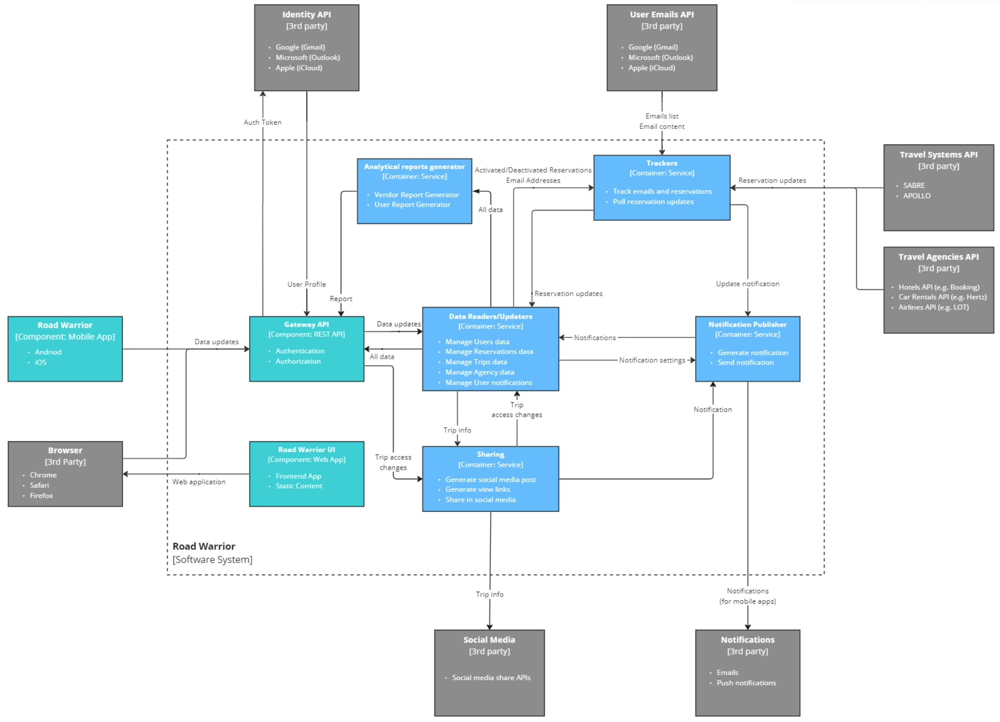
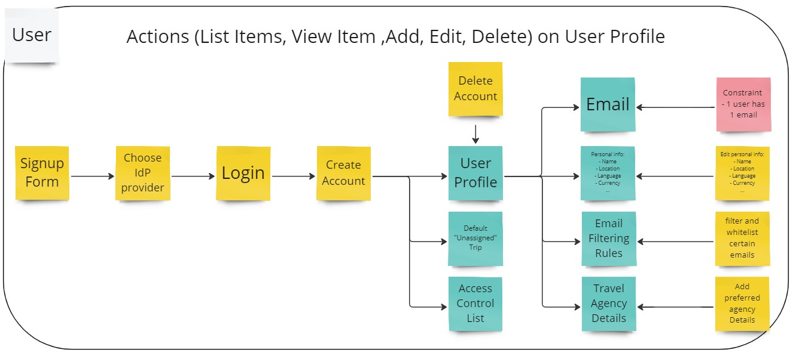
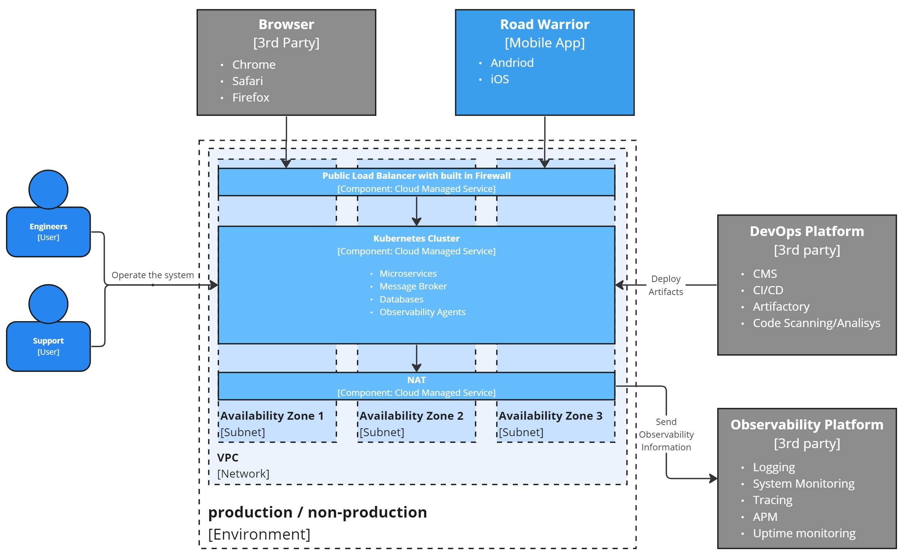
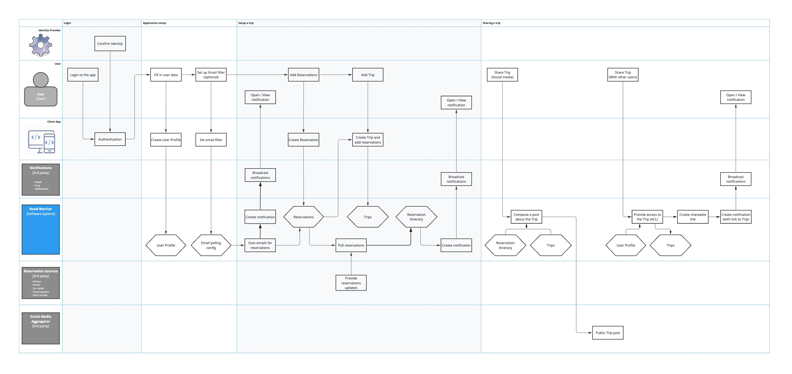

The **Viewpoints and Perspectives** is another architectural framework. It is
lightweight, versatile adaptable, as it is unbound by any specific tool
depencencies. At the same time various diagramming tools can be used to support
the work in this framework style, promoting efficient collaboration and
customization.

## The Need for Multiple Views

When designing complex software systems, it's crucial to avoid the trap of
representing the entire architecture in a single, **monolithic model**. Such an
approach often leads to **confusion**, inconsistencies, and **difficulty** in
understanding and communicating the design to stakeholders. Instead, a more
effective strategy is to adopt a multi-view approach, where the architecture is
descried by into multiple, **interconnected views**, each focusing on a specific
aspect of the system. This allows for a **better understanding**, management of
complexity, and **effective communication** with various stakeholders.

## General Overview

The framework of viewpoints and perspectives provides a structured and
comprehensive approach to capturing and representing software architecture.
**Viewpoints** serve as guides for creating specific types of views, while
**perspectives** are applied to these views to ensure that the architecture meets
desired **quality requirements**. This collaborative approach promotes better
communication, understanding, and decision-making throughout the development
process.

## Definitions

The framework gives a few definitions, crucial to it's understanding and
application:
* **Architectural View**: A view is a representation of one or more structural
  aspects of an architecture, illustrating how the architecture addresses
  specific concerns of stakeholders. For example, a functional view might depict
  the system's main components and their interactions, while a deployment view
  might illustrate the physical infrastructure where the system is deployed.
* **Architectural Viewpoint**: A viewpoint is a collection of patterns,
  templates, and conventions for constructing a specific type of view. It
  defines the stakeholders whose concerns are reflected in the view and provides
  guidelines for creating and describing that aspect of the architecture.
* **Architectural Perspective**: A perspective is a collection of architectural
  activities, tactics, and guidelines used to ensure that the system exhibits a
  particular set of related quality properties.
Note: while both viewpoints and perspectives guide architectural design, their
focus differs. Viewpoints primarily define the structure and content of views,
while perspectives focus on ensuring the architecture meets specific quality
requirements.

## Viewpoints

The framework offers the following list of viewpoints:

### The Context Viewpoint

* **Purpose**: To show the system's scope and boundaries by describing its
  interactions with external entities.
* **Key Stakeholders**: Business owners, end users, external system owners (to
  ensure clear interfaces and boundaries).
* **Concerns**:
  - Key external entities interacting with the system (e.g., users, other
    systems).
  - High-level descriptions of interfaces and data exchanged.
  - Overall environment and dependencies.
* **What is irrelevant**:
  - Internal details of the system (e.g., components, detailed data flows).
  - Overly detailed protocol specifications.

 
Source: [O'Reilly Katas 2023 Fall solution by Profitero Data Alchemists](https://github.com/Profitero-Data-Alchemists/katas-2023/tree/master)

### The Functional Viewpoint

* **Purpose**: To describe the system's functional structure and how its
  functions work together to fulfill requirements.
* **Key Stakeholders**: Product owners, system designers, test engineers.
* **Concerns**:
  - Functional decomposition into modules or components.
  - Interactions between functional components.
  - Functional requirements and responsibilities.
* **What is irrelevant**:
  - Deployment details (e.g., servers hosting components).
  - User interface specifics (unless a critical part of the function).

 
Source: [O'Reilly Katas 2023 Fall solution by Profitero Data Alchemists](https://github.com/Profitero-Data-Alchemists/katas-2023/tree/master)

### The Information Viewpoint

* **Purpose**: To define the structure, semantics, and usage of the system’s
  information.
* **Key Stakeholders**: Data architects, developers, business analysts.
* **Concerns**:
  - Data models (conceptual, logical, or physical).
  - Relationships between data entities.
  - Data lifecycles and flow between components.
* **What is irrelevant**:
  - Behavioral or functional information.
  - Storage technology specifics (unless critical to the architecture).

 
Source: [O'Reilly Katas 2023 Fall solution by Profitero Data Alchemists](https://github.com/Profitero-Data-Alchemists/katas-2023/tree/master)

### The Concurrency Viewpoint

* **Purpose**: To describe how the system handles multiple tasks and processes
  simultaneously.
* **Key Stakeholders**: System architects, developers, performance engineers.
* **Concerns**:
  - Processes, threads, or tasks and their interactions.
  - Synchronization mechanisms (e.g., locks, queues).
  - High-level process flows and resource sharing.
* **What is irrelevant**:
  - Low-level implementation code.
  - Non-concurrent components or workflows.

 
Source: [O'Reilly Katas 2023 Fall solution by Profitero Data Alchemists](https://github.com/Profitero-Data-Alchemists/katas-2023/tree/master)

### The Development Viewpoint

* **Purpose**: To describe the software's modular structure and its organization
  for efficient development.
* **Key Stakeholders**: Developers, build engineers.
* **Concerns**:
  - Modules, packages, or components and their dependencies.
  - Layered architecture or build-time structure.
  - Source control and integration guidelines.
* **What is irrelevant**:
  - Runtime behavior or deployment information.
  - Detailed user interactions or workflows.

 
Source: [O'Reilly Katas 2023 Fall solution by Profitero Data Alchemists](https://github.com/Profitero-Data-Alchemists/katas-2023/tree/master)

### The Deployment Viewpoint

* **Purpose**: To show how the system is deployed across hardware and other
  platforms.
* **Key Stakeholders**: Infrastructure engineers, operations teams, performance
  engineers.
* **Concerns**:
  - Hardware or cloud resources and their configurations.
  - Deployment of software components to nodes or devices.
  - Communication pathways and their performance constraints.
* **What is irrelevant**:
  - Detailed internal behaviors of software components.
  - Design-time or source-level module structures.

 
Source: [O'Reilly Katas 2023 Fall solution by Profitero Data Alchemists](https://github.com/Profitero-Data-Alchemists/katas-2023/tree/master)

### The Operational Viewpoint

* **Purpose**: To describe the system’s operational and maintenance processes.
* **Key Stakeholders**: Support teams, operations engineers, system
  administrators.
* **Concerns**:
  - Monitoring, logging, and alerting mechanisms.
  - Backup, recovery, and failover strategies.
  - Maintenance workflows and tools used.
What **is irrelevant**:
  - Functional or runtime details unrelated to operations.
  - Implementation-level details of monitoring or recovery mechanisms.

 
Source: [O'Reilly Katas 2023 Fall solution by Profitero Data Alchemists](https://github.com/Profitero-Data-Alchemists/katas-2023/tree/master)

## Perspectives

This is a list of most frequently used perspectives. Other perspectives can be
found in the original book.

### Security Perspective

* **Purpose**: Ensure that the system is protected against unauthorized access,
  breaches, and other security threats.
* **Key Stakeholders**: Security architects, developers, system administrators,
  compliance officers.
* **Concerns**: Threat models, access controls, encryption protocols, security
  policies, and mitigation strategies.
* **What is irrelevant**: Non-security-related functional requirements or
  aesthetic UI details.

Example: [O'Reilly Katas 2023 Fall solution by Profitero Data Alchemists](https://github.com/Profitero-Data-Alchemists/katas-2023/tree/master/security_perspective)

### Performance and Scalability Perspective

* **Purpose**: Ensure the system meets performance targets and scales
  effectively under increased load.
* **Key Stakeholders**: Performance engineers, developers, infrastructure
  architects, product managers.
* **Concerns**: Response times, throughput, resource utilization, load
  distribution, and scaling mechanisms.
* **What is irrelevant**: Detailed functional workflows unrelated to performance
  or scalability.

### Availability and Persistence Perspective

* **Purpose**: Ensure the system is consistently accessible and reliably stores
  critical data.
* **Key Stakeholders**: System administrators, database architects,
  infrastructure engineers, business continuity planners.
* **Concerns**: Redundancy strategies, failover mechanisms, backup plans, and
  data replication.
* **What is irrelevant**: Transient debugging or testing configurations that do
  not contribute to reliability.

### Evolution Perspective

* **Purpose**: Ensure the system can adapt to changing requirements,
  technologies, and business needs.
* **Key Stakeholders**: Solution architects, developers, product managers,
  enterprise architects.
* **Concerns**: Dependency diagrams, modular designs, upgrade plans, and
  mechanisms for change management.
* **What is irrelevant**: Overly specific implementation details tied to current
  technologies that hinder adaptability.

### Regulation Perspective

* **Purpose**: Ensure the system complies with relevant legal, industry, and
  organizational standards.
* **Key Stakeholders**: Compliance officers, legal teams, auditors, product
  managers.
* **Concerns**: Regulatory requirements, audit trails, adherence to data privacy
  standards, and certification needs.
* **What is irrelevant**: Internal operational processes or technical details
  not tied to compliance requirements.

### Conclusion

The framework provides a comprehencive overview of the architecture from
different aspects using various predefined viewponts and perspectives. By
utilising them architects can promote better communication, understanding, and
decision-making throughout the development process.

## Recommended Reading

##### Books

* Rozanski, N., & Woods, E. (2011). *[Software systems architecture: Working with stakeholders using viewpoints and perspectives](https://www.viewpoints-and-perspectives.info/home/book/)* . Addison-Wesley.
  * **Chapter 3: Viewpoints and Views, Chapter 4: Architectural Perspectives**\
    Provides an overview of Architectural Viewpoints and Perspectives available
    in the Framework.
