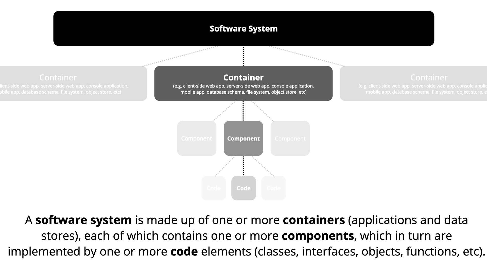
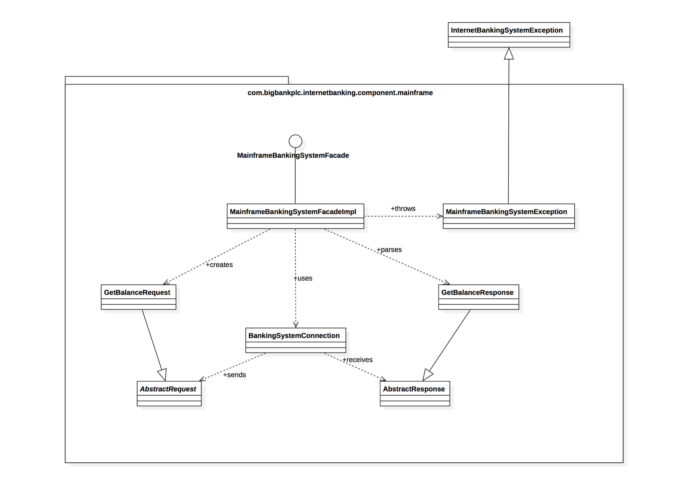
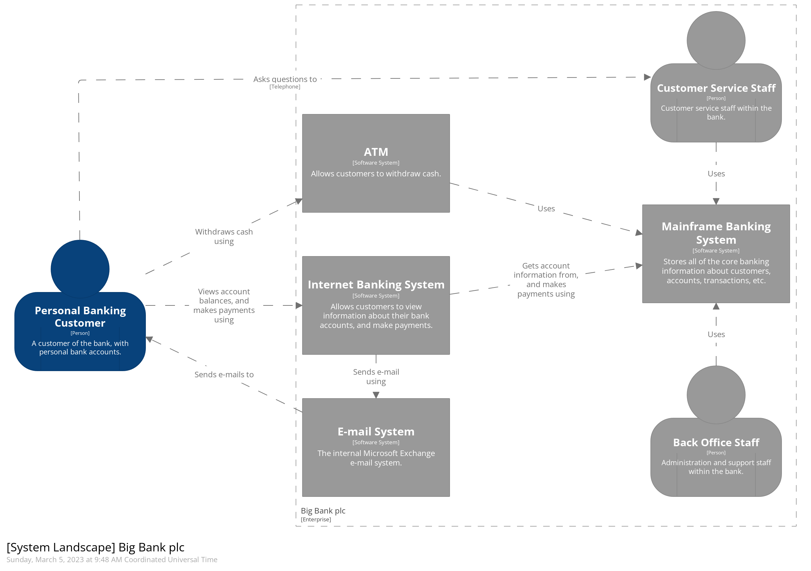
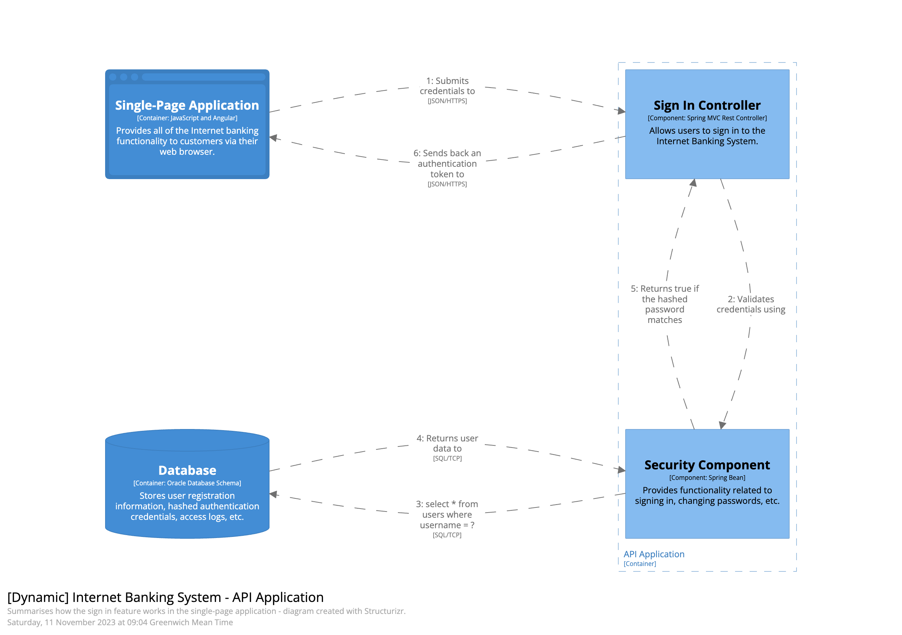

The **C4 model** is a hierarchical framework designed for visualizing the
architecture of software systems. It emphasizes **clarity and simplicity**, making
it accessible for both technical and non-technical stakeholders. The framework
consists of a set of diagram types that represent **different levels of
abstraction**, enabling users to convey the architecture of a system effectively.
It is **tool-agnostic**, allowing various tools to be employed for creating the
diagrams.

One of the significant benefits of the C4 model is its **"zoom-in" approach**,
allowing stakeholders to navigate from high-level diagrams to more detailed
ones. For example, an element depicted in the context diagram can be further
elaborated in a container diagram, and each container can be broken down into
its components in subsequent diagrams. This hierarchical representation not only
facilitates a deeper understanding of each element but also ensures that each
diagram serves a **specific purpose** while contributing to the overall narrative of
the system architecture.

## Abstractions

The framework defines elements of an architecture as a set of hierarchical
building blocks, namely:

- **Software system**, highest level of abstraction, brinding value to the end
  user
- **Container** - runtime boundary around an executable code or data stoaage,
  e.g. web application, database, etc.
- **Component** - grouping of related functionality, not separately deployable
- **Code** - lowest abstraction level, representing classes, functions and other
  entities from the programming language.

Each bulding block is composed from smaller blocks.

  
   
  <a href="https://c4model.com/abstractions">
    <small>Source: https://c4model.com/</small>
  </a>

---

## Default Diagrams

Framework defines four basic diagram types, corresponding to the abstractions
defined above. The diagrams are nested, which helps tackle the complexity of the
system.

---

### Context Diagram

Provides a high-level overview of the system and its
interactions with external entities. This diagram sets the stage for
understanding how the system fits into its broader environment.

  
   
  <a href="https://c4model.com/diagrams/system-context">
    <small>Source: https://c4model.com/</small>
  </a>

---

### Container Diagram

Breaks down the system into its major containers,
illustrating relationships between them. This level of detail allows
stakeholders to see how different parts of the system interact.

  
   
  <a href="https://c4model.com/diagrams/container">
    <small>Source: https://c4model.com/</small>
  </a>

---

### Component Diagram

Offers a detailed view of the components within a specific
container and their interactions. This helps in understanding the internal
structure of the container and how components collaborate to fulfill system
requirements.

  
   
  <a href="https://c4model.com/diagrams/component">
    <small>Source: https://c4model.com/</small>
  </a>

---

### Code Diagram

Focuses on the implementation level, typically showing classes
or modules within a component. This diagram is particularly useful for
developers to grasp the details of the code structure.

  
   
  <a href="https://c4model.com/diagrams/code">
    <small>Source: https://c4model.com/</small>
  </a>

---

## Adapting to Real World Usecases

The default diagrams create a foundation for describing the software system's
structure. However in order to address different aspects of the architecture,
some adjustments are needed. For the most popular usecases the C4 Model defines
additional diagrams.

---

### System Landscape Diagram

The **System Landscape** diagram extends the C4 Model by representing the **broader
ecosystem** of interconnected systems. Unlike the Context diagram, which focuses
on a single system and its external interactions, this diagram captures **multiple
systems** across a portfolio, their relationships, and the high-level data flows
between them, providing a **wider organizational perspective**.

  
   
  <a href="https://c4model.com/diagrams/system-landscape">
    <small>Source: https://c4model.com/</small>
  </a>

---

### Dynamic Diagram

The **Dynamic** diagram focuses on illustrating the **runtime behavior** of the
system by detailing the interactions and **sequence** of events between
components. Unlike the static structure of Container and Component diagrams,
this diagram emphasizes how elements collaborate during specific **use cases or
processes**, making it useful for understanding workflows and runtime scenarios.

  
   
  <a href="https://c4model.com/diagrams/dynamic">
    <small>Source: https://c4model.com/</small>
  </a>

---

### Deplyment Diagram

The **Deployment** diagram adds a **physical** perspective to the C4 Model by showing
how software elements are deployed across **hardware or infrastructure** nodes.
Unlike the Container and Component diagrams, which describe logical
architecture, the Deployment diagram provides details about **environments,
servers, containers**, and their connections, highlighting the operational aspect
of the system.

  
   
  <a href="https://c4model.com/diagrams/deployment">
    <small>Source: https://c4model.com/</small>
  </a>

---

## Recommended Reading

##### Articles

* Brown, S. *["Introduction to C4 Model"](https://c4model.com/introduction)*.
  Detailed description of the C4 architecture framework.
