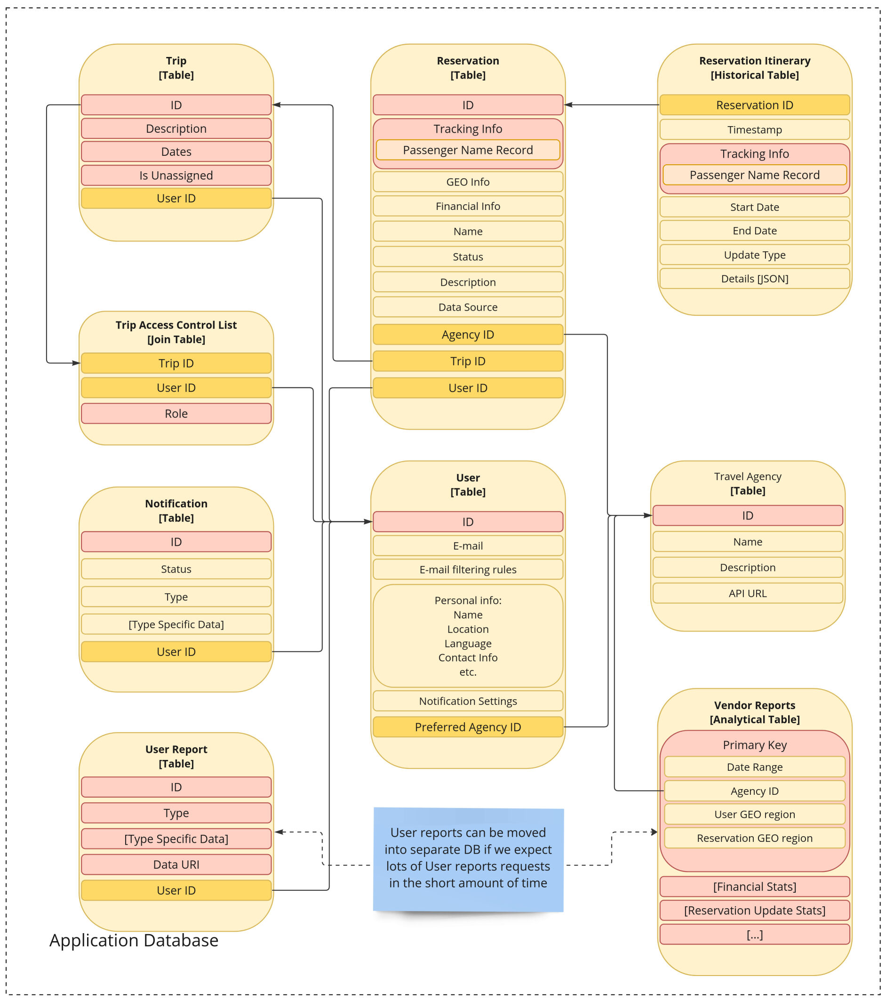
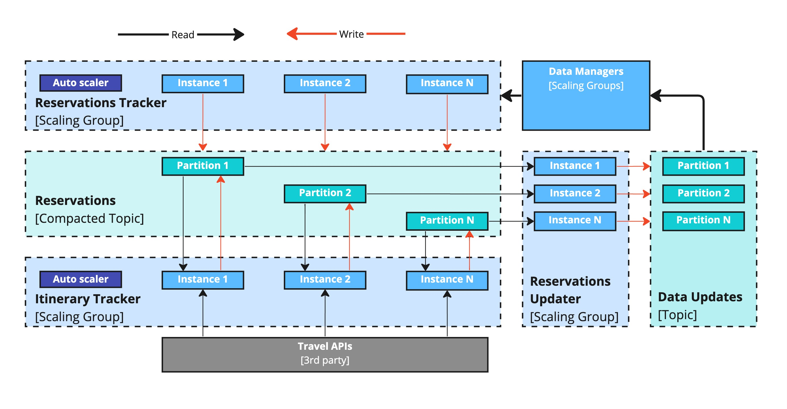
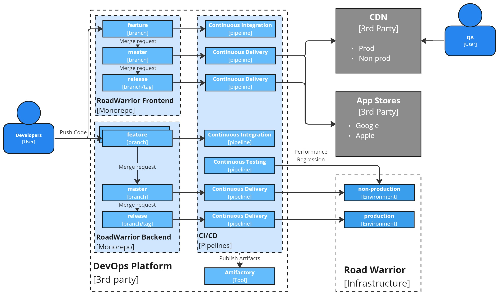

The **Viewpoints and Perspectives** is another architectural framework. It is
lightweight, versatile adaptable, as it is unbound by any specific tool
depencencies. At the same time various diagramming tools can be used to support
the work in this framework style, promoting efficient collaboration and
customization.

## The Need for Multiple Views

When designing complex software systems, it's crucial to avoid the trap of
representing the entire architecture in a single, **monolithic model**. Such an
approach often leads to **confusion**, inconsistencies, and **difficulty** in
understanding and communicating the design to stakeholders. Instead, a more
effective strategy is to adopt a multi-view approach, where the architecture is
descried by into multiple, **interconnected views**, each focusing on a specific
aspect of the system. This allows for a **better understanding**, management of
complexity, and **effective communication** with various stakeholders.

## General Overview

The framework of viewpoints and perspectives provides a structured and
comprehensive approach to capturing and representing software architecture.
**Viewpoints** serve as guides for creating specific types of views, while
**perspectives** are applied to these views to ensure that the architecture meets
desired **quality requirements**. This collaborative approach promotes better
communication, understanding, and decision-making throughout the development
process.

## Definitions

The framework gives a few definitions, crucial to it's understanding and
application:

* **Architectural View**: A view is a representation of one or more structural
  aspects of an architecture, illustrating how the architecture addresses
  specific concerns of stakeholders. For example, a functional view might depict
  the system's main components and their interactions, while a deployment view
  might illustrate the physical infrastructure where the system is deployed.
* **Architectural Viewpoint**: A viewpoint is a collection of patterns,
  templates, and conventions for constructing a specific type of view. It
  defines the stakeholders whose concerns are reflected in the view and provides
  guidelines for creating and describing that aspect of the architecture.
* **Architectural Perspective**: A perspective is a collection of architectural
  activities, tactics, and guidelines used to ensure that the system exhibits a
  particular set of related quality properties.
Note: while both viewpoints and perspectives guide architectural design, their
focus differs. Viewpoints primarily define the structure and content of views,
while perspectives focus on ensuring the architecture meets specific quality
requirements.

## Viewpoints

The framework offers the following list of viewpoints:

### The Context Viewpoint

The **Context** viewpoint defines the **scope** and boundaries of the system,
illustrating its **interactions** with external actors such as users, systems,
and environments. It provides a high-level overview to clarify what the system
is responsible for and what lies beyond its control. This viewpoint helps align
the **system’s purpose** with business objectives and ensures that stakeholders
share a common understanding of its role within a broader ecosystem. It serves
as a foundation for other viewpoints, offering essential insights into
**external dependencies** and how they influence system design and operation.

* **Purpose**: To show the system's scope and boundaries by describing its
  interactions with external entities.
* **Key Stakeholders**: Business owners, end users, external system owners (to
  ensure clear interfaces and boundaries).
* **Concerns**:
  * Key external entities interacting with the system (e.g., users, other
    systems).
  * High-level descriptions of interfaces and data exchanged.
  * Overall environment and dependencies.
* **What is irrelevant**:
  * Internal details of the system (e.g., components, detailed data flows).
  * Overly detailed protocol specifications.

  
    
  <a href="https://github.com/Profitero-Data-Alchemists/katas-2023/tree/master?tab=readme-ov-file#context-viewpoint">
    <small>Source: O'Reilly Katas 2023 Fall solution by Profitero Data Alchemists</small>
  </a>

---

### The Functional Viewpoint

The **Functional** viewpoint focuses on the system's **functions** and
**capabilities**, describing how they interact to achieve the system's goals. It
captures the **functional structure** and provides details about key processes
and their coordination. By mapping out the **logical flow** of operations, this
viewpoint clarifies how user needs are met through well-defined workflows. It
helps identify critical functions, dependencies, and opportunities for
optimization, serving as a key reference for system requirements and design
decisions. This viewpoint is essential for ensuring that the system aligns with
user expectations and business requirements.

* **Purpose**: To describe the system's functional structure and how its
  functions work together to fulfill requirements.
* **Key Stakeholders**: Product owners, system designers, test engineers.
* **Concerns**:
  * Functional decomposition into modules or components.
  * Interactions between functional components.
  * Functional requirements and responsibilities.
* **What is irrelevant**:
  * Deployment details (e.g., servers hosting components).
  * User interface specifics (unless a critical part of the function).

  
    
  <a href="https://github.com/Profitero-Data-Alchemists/katas-2023/tree/master?tab=readme-ov-file#functional-viewpoint">
    <small>Source: O'Reilly Katas 2023 Fall solution by Profitero Data Alchemists</small>
  </a>

---

### The Information Viewpoint

The **Information** viewpoint addresses the **organization, storage, and flow of
data** within the system. It focuses on how data is structured, its
relationships, and how it is exchanged between components, providing insight
into the logical data architecture. This viewpoint supports the development
of robust data models and ensures consistency in data handling across the
system. It highlights the lifecycle of critical data entities, enabling
designers to optimize **data integrity** and performance. Additionally, it
provides a basis for identifying risks related to potential bottlenecks in data
processing pipelines.

* **Purpose**: To define the structure, semantics, and usage of the system’s
  information.
* **Key Stakeholders**: Data architects, developers, business analysts.
* **Concerns**:
  * Data models (conceptual, logical, or physical).
  * Relationships between data entities.
  * Data lifecycles and flow between components.
* **What is irrelevant**:
  * Behavioral or functional information.
  * Storage technology specifics (unless critical to the architecture).

  
    
  <a href="https://github.com/Profitero-Data-Alchemists/katas-2023/blob/master/information_viewpoint/README.md#here-you-can-find-more-details-about-proposed-data-model">
    <small>Source: O'Reilly Katas 2023 Fall solution by Profitero Data Alchemists</small>
  </a>

---

### The Concurrency Viewpoint

The **Concurrency** viewpoint describes the **runtime interactions** between
system components, focusing on services, jobs, and their communication.
It helps in identifying synchronization needs and avoiding issues like
**deadlocks** and **resource contention**. By representing how components
collaborate under different workloads, this viewpoint ensures that the system
can handle concurrent operations efficiently. It highlights the dynamic behavior
of the system, aiding in the design of mechanisms like **task orchestration** and
**thread management**. Additionally, it provides insights into potential points
of failure related to **race conditions** or excessive resource utilization.

* **Purpose**: To describe how the system handles multiple tasks and processes
  simultaneously.
* **Key Stakeholders**: System architects, developers, performance engineers.
* **Concerns**:
  * Processes, threads, or tasks and their interactions.
  * Synchronization mechanisms (e.g., locks, queues).
  * High-level process flows and resource sharing.
* **What is irrelevant**:
  * Low-level implementation code.
  * Non-concurrent components or workflows.

  
   
  <a href="https://github.com/Profitero-Data-Alchemists/katas-2023/tree/master?tab=readme-ov-file#concurrency-viewpoint">
    <small>Source: O'Reilly Katas 2023 Fall solution by Profitero Data Alchemists</small>
  </a>

---

### The Development Viewpoint

The **Development** viewpoint focuses on the software architecture as seen
by the developers, covering the structure of modules, libraries and other
artifacts with their build pipelines. It aids in understanding **implementation
dependencies** and managing the development process effectively. This viewpoint
provides a blueprint for module organization, design, testing, implementation
processes. It also highlights the relationships between components, enabling
teams to identify potential impacts of changes and improve overall
maintainability. By addressing **technical debt** and development workflows,
this viewpoint ensures a smoother implementation phase.

* **Purpose**: To describe the software's modular structure and its organization
  for efficient development.
* **Key Stakeholders**: Developers, build engineers.
* **Concerns**:
  * Modules, packages, or components and their dependencies.
  * Layered architecture or build-time structure.
  * Source control and integration guidelines.
* **What is irrelevant**:
  * Runtime behavior or deployment information.
  * Detailed user interactions or workflows.

  
    
  <a href="https://github.com/Profitero-Data-Alchemists/katas-2023/tree/master?tab=readme-ov-file#development-viewpoint">
    <small>Source: O'Reilly Katas 2023 Fall solution by Profitero Data Alchemists</small>
  </a>

---

### The Deployment Viewpoint

The **Deployment** viewpoint describes the **physical environment** where the
system operates, detailing hardware, networks, and operational configurations.
It ensures that the system can be efficiently **hosted and maintained**. This
viewpoint helps identify **resource requirements**, such as processing power and
storage, while addressing constraints related to **scalability** and
**availability**. It illustrates the mapping of software components onto
physical infrastructure, facilitating decisions about hosting, failover
mechanisms, and **disaster recovery** strategies. By considering real-world
deployment conditions, it ensures the system's operational readiness and
resilience.

* **Purpose**: To show how the system is deployed across hardware and other
  platforms.
* **Key Stakeholders**: Infrastructure engineers, operations teams, performance
  engineers.
* **Concerns**:
  * Hardware or cloud resources and their configurations.
  * Deployment of software components to nodes or devices.
  * Communication pathways and their performance constraints.
* **What is irrelevant**:
  * Detailed internal behaviors of software components.
  * Design-time or source-level module structures.

  
    
  <a href="https://github.com/Profitero-Data-Alchemists/katas-2023/tree/master?tab=readme-ov-file#deployment-viewpoint">
    <small>Source: O'Reilly Katas 2023 Fall solution by Profitero Data Alchemists</small>
  </a>

---

### The Operational Viewpoint

The **Operational** viewpoint focuses on the system’s day-to-day **management
and maintenance**, covering aspects such as monitoring, troubleshooting, and
updates. It ensures that the system operates smoothly post-deployment. This
viewpoint emphasizes the tools, processes, and metrics needed to support
reliable operations. By addressing potential operational challenges, it
clarifies the processes maintenance, operation, configuration, migration. It
also highlights the responsibilities of different roles, ensuring that
operational teams are **equipped to handle incidents** effectively and adapt to
changing environment.

* **Purpose**: To describe the system’s operational and maintenance processes.
* **Key Stakeholders**: Support teams, operations engineers, system
  administrators.
* **Concerns**:
  * Monitoring, logging, and alerting mechanisms.
  * Backup, recovery, and failover strategies.
  * Maintenance workflows and tools used.
What **is irrelevant**:
  * Functional or runtime details unrelated to operations.
  * Implementation-level details of monitoring or recovery mechanisms.

  
    
  <a href="https://github.com/Profitero-Data-Alchemists/katas-2023/tree/master?tab=readme-ov-file#operational-viewpoint">
    <small>Source: O'Reilly Katas 2023 Fall solution by Profitero Data Alchemists</small>
  </a>

---

## Perspectives

This is a list of most frequently used perspectives. Other perspectives can be
found in the original book.

### Security Perspective

The **Security** perspective ensures that a software system is protected against
**unauthorized access**, **malicious attacks**, and **data breaches**. Its purpose is to
safeguard sensitive information and maintain the **integrity, confidentiality,
and availability** of the system. This perspective involves identifying potential
risks, implementing defenses such as encryption and access controls, and
preparing incident response plans.

* **Purpose**: Ensure that the system is protected against unauthorized access,
  breaches, and other security threats.
* **Key Stakeholders**: Security architects, developers, system administrators,
  compliance officers.
* **Concerns**: Threat models, access controls, encryption protocols, security
  policies, and mitigation strategies.
* **What is irrelevant**: Non-security-related functional requirements or
  aesthetic UI details.

Example: [O'Reilly Katas 2023 Fall solution by Profitero Data Alchemists](https://github.com/Profitero-Data-Alchemists/katas-2023/tree/master/security_perspective)

---

### Performance and Scalability Perspective

The **Performance and Scalability** perspective focuses on ensuring that a
system meets its **performance goals** under normal and peak conditions and can
**handle growth** in users, data, or processing demands. Key aspects include
measuring response times, optimizing resource utilization, and designing for
scalability.

* **Purpose**: Ensure the system meets performance targets and scales
  effectively under increased load.
* **Key Stakeholders**: Performance engineers, developers, infrastructure
  architects, product managers.
* **Concerns**: Response times, throughput, resource utilization, load
  distribution, and scaling mechanisms.
* **What is irrelevant**: Detailed functional workflows unrelated to performance
  or scalability.

---

### Availability and Persistence Perspective

The **Availability and Persistence** perspective ensures that a system is
reliably accessible and consistently maintains its critical data over time. By
addressing factors such as **redundancy, failover mechanisms**, and data
backups, this perspective minimizes downtime and protects against catastrophic
failures.

* **Purpose**: Ensure the system is consistently accessible and reliably stores
  critical data.
* **Key Stakeholders**: System administrators, database architects,
  infrastructure engineers, business continuity planners.
* **Concerns**: Redundancy strategies, failover mechanisms, backup plans, and
  data replication.
* **What is irrelevant**: Transient debugging or testing configurations that do
  not contribute to reliability.

---

### Evolution Perspective

The **Evolution** perspective ensures that a system can **adapt to changing
requirements**, technologies, and business environments. This perspective involves
planning for modularity, managing dependencies, and **accommodating iterative
updates** to the architecture.

* **Purpose**: Ensure the system can adapt to changing requirements,
  technologies, and business needs.
* **Key Stakeholders**: Solution architects, developers, product managers,
  enterprise architects.
* **Concerns**: Dependency diagrams, modular designs, upgrade plans, and
  mechanisms for change management.
* **What is irrelevant**: Overly specific implementation details tied to current
  technologies that hinder adaptability.

---

### Regulation Perspective

The **Regulation** perspective ensures that a system complies with **legal,
regulations**, and organizational standards, including privacy, data protection,
and security requirements. This perspective involves identifying relevant
regulations, designing features to meet them, and providing audit trails for
**accountability**.

* **Purpose**: Ensure the system complies with relevant legal, industry, and
  organizational standards.
* **Key Stakeholders**: Compliance officers, legal teams, auditors, product
  managers.
* **Concerns**: Regulatory requirements, audit trails, adherence to data privacy
  standards, and certification needs.
* **What is irrelevant**: Internal operational processes or technical details
  not tied to compliance requirements.

---

### Conclusion

The framework provides a comprehencive overview of the architecture from
different aspects using various predefined viewponts and perspectives. By
utilising them architects can promote better communication, understanding, and
decision-making throughout the development process.

## Recommended Reading

##### Books

* Rozanski, N., & Woods, E. (2011). *[Software systems architecture: Working with stakeholders using viewpoints and perspectives](https://www.viewpoints-and-perspectives.info/home/book/)* . Addison-Wesley.
  * **Chapter 3: Viewpoints and Views, Chapter 4: Architectural Perspectives**\
    Provides an overview of Architectural Viewpoints and Perspectives available
    in the Framework.
