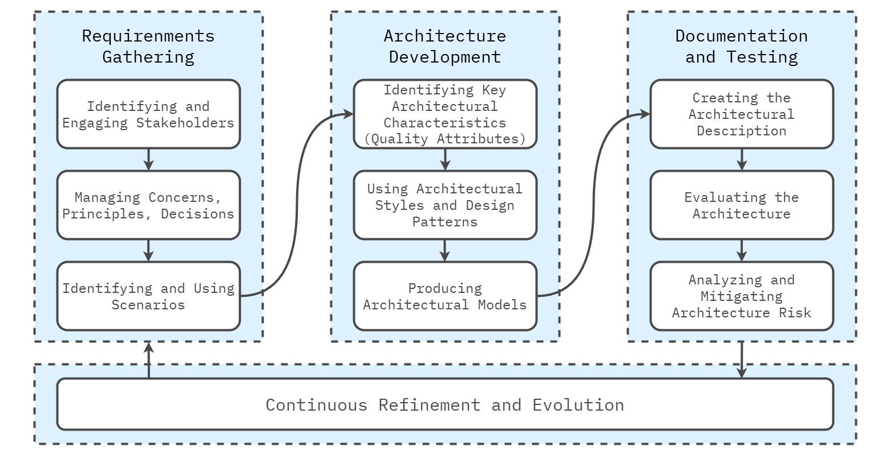

## What is the architecture process?

The **Architecture Definition Process** is an iterative and structured approach designed to guide a software system's lifecycle. It ensures its architecture supports functional and non-functional requirements, evolves with the system, and aligns with business goals. This process integrates stakeholder engagement, decision-making, risk management, and continuous refinement, allowing the architecture to remain scalable, maintainable, and adaptable.

Each process step is crucial to successfully defining, developing, and managing the architecture, ensuring it evolves as needed. Each step is detailed below to provide a comprehensive understanding of the architecture definition process.

   

---

## Step 1: Identifying and Engaging Stakeholders

The process begins with identifying and engaging stakeholders—individuals or groups with a vested interest in the system's architecture. Stakeholder involvement is essential in shaping the architecture to meet business and technical needs.

#### Key Actions:

1. **Identify key stakeholders**: Determine who will influence or be impacted by the architecture, such as business owners, users, developers, and operations teams.
2. **Classify stakeholders**: Group stakeholders into categories—primary (direct involvement), secondary (indirect involvement), and tertiary (peripheral influence).
3. **Engage stakeholders**: Establish regular communication to ensure stakeholder concerns and needs are captured throughout the architecture process.

By engaging stakeholders early, architects ensure the architecture is designed to meet real-world needs, preventing misalignment and minimizing future rework.

---

## Step 2: Managing Concerns, Principles, and Decisions

Managing concerns, principles, and decisions is foundational to the architecture definition process. Architects must balance problem-focused concerns (functional and non-functional requirements) with solution-focused concerns (how to address these requirements) while adhering to core principles that guide the system’s design.

#### Key Actions:

1. **Identify problem-focused concerns**: Understand what the system needs to achieve, such as performance benchmarks, security needs, scalability, and usability.
2. **Address solution-focused concerns**: Determine how the system will meet these needs, including decisions around architectural styles, technology choices, and design approaches.
3. **Apply architectural principles**: Use guiding principles like modularity, scalability, security, and maintainability to inform the architecture's direction and consistency.
4. **Document decisions**: Record architectural decisions in **Architecture Decision Records (ADRs)**, capturing the rationale behind each choice and the trade-offs considered.

Effectively managing concerns and decisions ensures the architecture is well-grounded, flexible, and aligned with stakeholder expectations.

---

## Step 3: Identifying and Using Scenarios

Scenarios provide a concrete means to test and validate architectural decisions. They represent the system's behavior under different conditions, helping architects ensure it meets functional and non-functional requirements.

#### Key Actions:

1. **Identify critical scenarios**: Develop functional (e.g., user interactions) and non-functional (e.g., performance, scalability) scenarios that reflect real-world use cases and system behavior.
2. **Capture scenarios in detail**: Document each scenario, including its context, expected outcome, and the specific architectural concerns it addresses.
3. **Validate architecture with scenarios**: Use scenarios to test whether the architecture meets the defined requirements under typical and extreme conditions.
4. **Analyze trade-offs with scenarios**: Evaluate the trade-offs of different architectural decisions based on how the system performs under these scenarios (e.g., balancing scalability with complexity).

Scenarios are essential for testing and validating architecture, ensuring it can handle real-world demands while addressing key system concerns.

---

## Step 4: Identifying Key Architectural Characteristics (Quality Attributes)

Identifying **key architectural characteristics** — also referred to as **quality attributes** — is one of the most critical aspects of the architecture definition process. These characteristics dictate the architectural style and decisions made throughout the process. Quality attributes such as performance, scalability, security, and maintainability drive architects' technical and design choices.

#### Key Actions:

1. **Define essential quality attributes**: Work with stakeholders to identify the core architectural characteristics that the system must support. Common attributes include:
   * **Performance**: How the system must perform under various loads (e.g., response times, throughput).
   * **Scalability**: The system’s ability to grow and handle increased workloads without degrading performance.
   * **Security**: Protecting the system from unauthorized access and ensuring data integrity.
   * **Availability**: Ensuring the system is operational and accessible when needed.
   * **Maintainability**: How easily the system can be updated, improved, or repaired over time.
   * **Usability**: Ensuring the system is user-friendly and meets user experience goals.
2. **Prioritize quality attributes**: Not all quality attributes are equally important. Work with stakeholders to rank them based on business needs and technical requirements. For example, a real-time trading platform may prioritize performance and scalability over flexibility.
3. **Create measurable benchmarks**: Define specific, measurable criteria for each attribute. For example, scalability might be measured by the system’s ability to handle 10,000 concurrent users, while performance might target sub-second response times under typical load conditions.
4. **Evaluate how architectural decisions affect quality attributes**: Consider the impact of each architectural decision on the quality attributes. For example, choosing a microservices architecture can enhance scalability but might add complexity and maintenance overhead.

Identifying and prioritizing quality attributes is essential, as these characteristics directly inform the choice of architectural style and other critical design decisions in the next step.

---

## Step 5: Using Architectural Styles and Design Patterns

Architects can now select appropriate **architectural styles** and **design patterns** based on the identified architectural characteristics and quality attributes. These choices provide a framework for organizing the system and addressing the identified challenges.

#### Key Actions:

1. **Select appropriate architectural styles**: Choose an architectural style that best addresses the system’s prioritized quality attributes. For instance, a **microservices** architecture might be chosen to support scalability and flexibility, while a **layered architecture** might be more suitable for maintainability and clear separation of concerns.
2. **Apply design patterns**: Leverage design patterns like **Singleton**, **Observer**, or **Repository** to solve common technical challenges within the chosen architectural style. These patterns provide reusable solutions to issues such as state management, communication, or data access.
3. **Leverage patterns for system-wide concerns**: Use architectural patterns to address overarching system requirements like reliability and performance. For example, the **Circuit Breaker pattern** can prevent cascading failures in a distributed system, while the **Repository pattern** can abstract data access to improve maintainability.
4. **Document style and pattern decisions**: Record the rationale behind choosing certain architectural styles and design patterns. This documentation ensures alignment and consistency across development teams and allows for easier onboarding of new team members.

By selecting suitable architectural styles and design patterns, architects can ensure that the system is built on a foundation that efficiently meets current and future demands.

---

## Step 6: Producing Architectural Models

**Architectural models** are critical to representing the system’s structure, behavior, and deployment in a visual and structured format. These models simplify complex systems, making it easier for stakeholders to understand how the architecture will be realized.

#### Key Actions:

1. **Create structural models**: Develop models that describe the organization of the system's components and how they interact. These models show the system's relationships between services, modules, or layers.
2. **Develop behavioral models**: Model the system's behavior over time, particularly the interaction between components. Behavioral models visualize workflows, event-driven interactions, and data flows.
3. **Build deployment models**: Create models showing how software components will be deployed across the physical or cloud-based infrastructure. Deployment models are crucial for ensuring the architecture is scalable, resilient, and performs well in its operational environment.
4. **Use standardized modeling languages**: Leverage languages like **C4** or **UML** to create consistent and clear models that are easy for different teams to interpret.
5. **Update models as needed**: As the architecture evolves, ensure that models reflect changes to the system’s structure, behavior, and deployment.

Architectural models are vital communication tools that help stakeholders understand how the system will be structured and behave.

---

## Step 7: Creating the Architectural Description

The **architectural description** is the formal documentation of the system’s architecture. It provides a comprehensive view of the system's design, ensuring all stakeholders are aligned and the architecture is well-documented for future reference.

#### Key Actions:

1. **Structure the description clearly**: The architectural description should include an overview of the system, stakeholder analysis, architectural views, key architectural decisions, and a glossary of terms.
2. **Ensure clarity and detail**: The description should cater to technical and non-technical stakeholders, balancing detailed technical diagrams with high-level overviews explaining how the architecture supports business goals.
3. **Follow industry standards**: Use established frameworks like **ISO/IEC/IEEE 42010** to ensure the architectural description is well-structured, comprehensive, and follows best practices.
4. **Tailor the presentation**: Present the architecture to different audiences in a way that highlights the aspects most relevant to them (e.g., high-level goals for executives and detailed technical information for developers).

The architectural description is essential for guiding development teams and ensuring all stakeholders align on the architecture’s design and direction.

---

## Step 8: Evaluating the Architecture

Regular **architecture evaluation** is critical to ensuring that the architecture continues to meet its goals and remains aligned with both technical and business requirements. Evaluation helps identify weaknesses, risks, and opportunities for improvement.

#### Key Actions:

1. **Use scenario-based evaluation**: Test the architecture against defined scenarios to ensure it behaves as expected. For example, test how the system handles high traffic loads or potential security breaches.
2. **Conduct expert reviews**: Involve external experts or experienced team members to review the architecture and provide insights on its strengths and potential risks.
3. **Perform evaluations regularly**: Continuously evaluate the architecture at critical milestones to ensure it remains aligned with evolving requirements and business needs.
4. **Document evaluation results**: Record the outcomes of each evaluation, including risks identified and adjustments made to the architecture.

Regular architecture evaluation ensures the system can adapt to changes and meet its technical and business objectives.

---

## Step 9: Analyzing and Mitigating Architecture Risk

Proactively managing **architecture risk** is essential to preventing critical issues from arising later in the system's lifecycle. Risks may stem from technology choices, scalability challenges, security vulnerabilities, or integration complexities.

#### Key Actions:

1. **Identify potential risks**: Use techniques such as architecture reviews, stakeholder interviews, and prototyping to uncover risks related to performance, scalability, and security.
2. **Assess risk impact and likelihood**: Evaluate each risk based on how likely it is to occur and its potential impact on the system. Prioritize high-impact, high-likelihood risks.
3. **Develop mitigation strategies**: Create strategies to reduce or eliminate risks. This may involve simplifying the architecture, choosing more mature technologies, or building redundancy into the system.
4. **Continuously monitor risks**: Risk management is an ongoing process. Continuously assess risks throughout the system’s lifecycle to ensure new risks are identified and mitigated early.

By identifying and addressing risks early in the process, architects can prevent costly or critical issues from arising later in the project lifecycle.

---

## Step 10: Continuous Refinement and Evolution

Architecture is not static; it must evolve as the system grows, user needs change, and new technologies emerge. Continuous refinement ensures the system remains aligned with business and technical goals while adapting to future changes.

#### Key Actions:

1. **Monitor trends and emerging risks**: Stay aware of new trends, technologies, and risks that could impact the architecture, and adjust as necessary.
2. **Revisit architectural decisions**: Periodically review and reassess past architectural decisions to ensure they still meet the system’s current needs.
3. **Incorporate stakeholder feedback**: As business goals or stakeholder priorities change, update the architecture to reflect new requirements and concerns.
4. **Manage technical debt**: Track and reduce technical debt to ensure it doesn’t accumulate and hinder future scalability or maintainability.
5. **Ensure future flexibility**: Design the architecture for easy modifications, ensuring it remains scalable, flexible, and aligned with future business needs.

By continuously refining the architecture, architects ensure that the system stays relevant and resilient as it evolves.

---

## Conclusion

The **Architecture Definition Process** is a comprehensive and adaptive practice that guides a system's architecture's design, development, and evolution. By following this structured approach—starting with stakeholder engagement, progressing through scenario validation, managing risks, and continuously refining the system—architects ensure that the architecture is robust, scalable, and adaptable to change. Each step, from identifying key architectural characteristics to evaluating and refining the architecture, is vital in ensuring long-term system success and alignment with technical and business goals.

---

## Recommended Reading

#### Articles

* Rozanski, Nick and Woods, Eoin. *["Stakeholders in Software Systems Architecture."](https://www.viewpoints-and-perspectives.info/home/stakeholders/)*.
  This article provides an in-depth exploration of identifying and managing stakeholder concerns, crucial for the success of any architectural project. It covers how to engage with stakeholders effectively and addresses their varying perspectives to ensure the architecture meets diverse requirements.

#### Books

* Rozanski, N., & Woods, E. (2011). *[Software systems architecture: Working with stakeholders using viewpoints and perspectives](https://www.viewpoints-and-perspectives.info/home/book/)* . Addison-Wesley.
  * **Part II - The Process of Software Architecture**\
    It covers the **software architecture process** , focusing on how architects define, design, and maintain architecture throughout a project’s lifecycle. It highlights the importance of addressing both **problem- and solution-focused concerns** , engaging with **stakeholders** , and using **scenarios** to explore requirements and validate decisions. The use of **architectural styles, patterns** , and **models** ensures that the system structure is clearly communicated. Additionally, the process includes creating thorough **architectural descriptions** and **evaluating** the architecture to ensure it meets both functional and non-functional needs. This section emphasizes an iterative, stakeholder-driven approach to architecture.
* Richards, M., & Ford, N. (2020). *[Fundamentals of Software Architecture: An Engineering Approach](https://www.oreilly.com/library/view/fundamentals-of-software/9781492043447/)* . O'Reilly Media.
  * **Chapter 19: Architecture Desicions**\
    It highlights the importance of documenting architecture decisions using Architecture Decision Records (ADRs). It emphasizes balancing trade-offs, managing constraints, and avoiding anti-patterns like decision paralysis. A structured decision-making process ensures well-informed, adaptable choices that support long-term system goals.
  * **Chapter 20 - Analyzing Architecture Risk**\
    It covers architecture risk analysis, emphasizing proactive identification and mitigation of risks. Techniques like prototyping and incremental delivery help manage risks, while avoiding anti-patterns like risk blindness ensures system resilience and adaptability.
