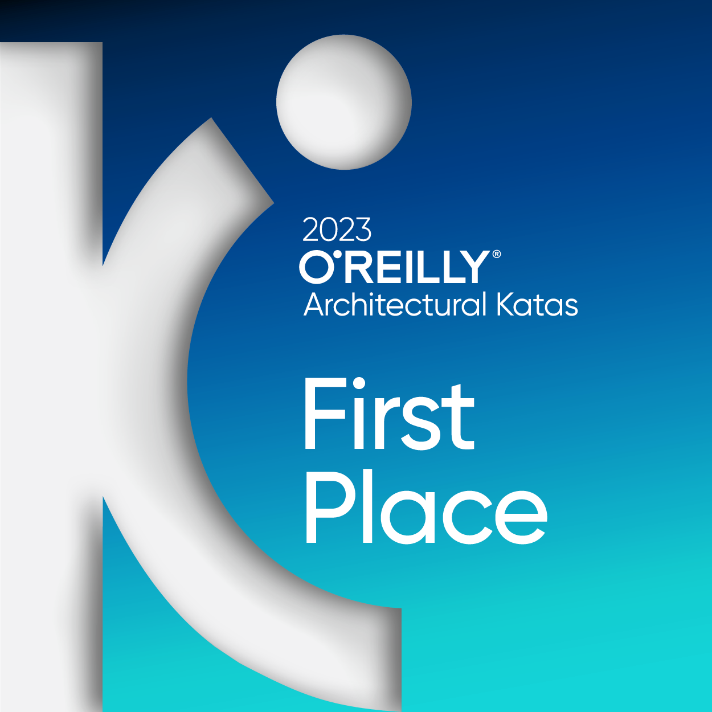

## What Are Architectural Katas?

**Architectural Katas** is a collaborative, hands-on event designed to help software architects and developers sharpen their architecture design skills in a fun and engaging way. The term "kata" is borrowed from martial arts, referring to a series of practice movements designed to build proficiency. In this context, **Architectural Katas** refers to a structured exercise where participants design software architectures for complex, real-world scenarios.

The main goal of an Architectural Kata is to simulate the challenges architects face when building systems. It encourages participants to think critically about design trade-offs, scalability, and maintainability while working within a set of constraints. It also provides an opportunity for participants to work in teams, share ideas, and get feedback from experienced mentors and peers.

## Our Journey in O'Reilly Architectural Katas

**September 2023** marked an exciting milestone for our team as we participated in the **[Architectural Katas](https://www.oreilly.com/live-events/architectural-katas/0636920458487/)** competition. Our mission was to design the architecture for **"Road Warrior"**, an innovative online trip management dashboard. This platform aims to provide travelers with a comprehensive solution to seamlessly organize and manage their reservations. You can view the [original requirements here](https://github.com/Profitero-Data-Alchemists/katas-2023/blob/master/requirements/original_requirements.md).

#### The Challenge

We were given **seven days** to develop a detailed architectural description and submit our proposal. We utilized **Viewpoints and Perspectives** as our architectural framework and employed the **C4 model** for our diagramming needs to tackle this.

#### The Competition

In the initial round, our submission was among the **top five** selected by the judges. This achievement gave us the opportunity to advance to the next phase, where we had a few days to prepare a comprehensive presentation and record a **five-minute video**. These materials were essential to explain and advocate for our architectural design to the judging panel.

* **[Final Presentation](https://github.com/Profitero-Data-Alchemists/katas-2023/blob/master/KATAS%202023%20-%20final%20presentation.pptx)**
* **[Presentation Video](https://www.youtube.com/watch?v=31RLrp68yvc)**

#### Victory!!!

We are thrilled to share that our hard work and dedication paid off—we **won** the competition!

## Explore Our Work

Feel free to explore our **[Architectural Description](https://github.com/Profitero-Data-Alchemists/katas-2023)** in detail. While achieving such a high level of detail in real-world projects can be challenging, this exercise was invaluable in demonstrating the effectiveness of combining **Viewpoints and Perspectives** with the **C4 model**.

## All winners

For more examples of software architecture descriptions, visit [The Architecture Kata Log](https://github.com/TheKataLog)
