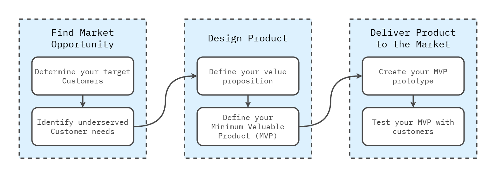

Product development is a multi-faceted process that transforms ideas into tangible products to solve customer needs. A structured approach helps companies navigate this complex process, focusing on reducing waste, iterating quickly, and achieving product-market fit. This article explores key concepts in product development, including core principles, the lean product process, and building and optimizing products.

---

## Core Concepts

At the heart of lean product development is the concept of **Product-Market Fit**. Product-market fit means developing a product that solves a customer problem better than any alternative. This is crucial because most product failures occur when companies build something customers do not need or want.

##### The Product-Market Fit Pyramid

A valuable framework for achieving product-market fit is the **Product-Market Fit Pyramid**. It is a layered model consisting of five components:

1. **Target Customer**: Who are you building the product for? These are the people whose problems you are solving.
2. **Underserved Needs**: What specific needs of the target customer are unmet by existing products?
3. **Value Proposition**: How does your product meet these underserved needs better than the alternatives?
4. **Feature Set**: What features will your product offer to deliver the value proposition?
5. **User Experience (UX)**: How will customers interact with your product, and how will it feel and function for them?

These five elements guide product teams from understanding their customers’ problems to delivering a solution that fits well into the market.

##### Problem Space vs. Solution Space

An essential distinction in product development is between the **problem space** and the **solution space**. The problem space is about fully understanding customer needs without jumping to specific solutions. It encourages teams to focus intensely on the real problems before jumping to conclusions about how to solve them.

Product development and design occur in the **solution space**, offering potential solutions to the problems identified earlier. Teams often risk jumping too quickly into the solution space, leading to products that fail to address the right problems effectively. Separating these two areas ensures that products are built to solve real issues.

A classic example of this distinction involves a space pen that works in zero gravity. While one organization spent significant resources developing a pen that would work in space, another opted for a simple and inexpensive solution: using a pencil. This highlights the importance of thoroughly exploring the problem before committing to a solution.

---

## Lean Product Process

The lean product development process has six iterative steps that help teams work methodically toward product-market fit. Each step involves testing with customers and refining ideas based on feedback.

   

##### Step 1: Determine Your Target Customers

Understanding your target customers is the first step. Customers can be identified through demographic, psychographic, and behavioral segmentation. Creating detailed personas—representative archetypes of your ideal customers—helps ensure every decision is made with their needs in mind.

##### Step 2: Identify Underserved Customer Needs

This step involves pinpointing specific customer problems or unmet needs that current solutions fail to address. Tools such as the **Importance versus Satisfaction Framework** help categorize and prioritize these needs, allowing teams to focus on the most critical gaps in the market.

##### Step 3: Define Your Value Proposition

Once customer needs are identified, the next step is to define a **value proposition**. This outlines how your product uniquely meets these needs better than competitors. A strong value proposition communicates why customers should choose your product.

##### Step 4: Specify Your Minimum Viable Product (MVP) Feature Set

The **Minimum Viable Product (MVP)** concept is central to lean development. Instead of building a fully-featured product, the MVP focuses on the smallest feature set that provides enough value to early adopters. This allows you to test and validate your ideas without overinvesting in development.

##### Step 5: Create Your MVP Prototype

Prototyping involves developing a simplified, working product version that customers can test. These prototypes can range from basic wireframes to more interactive models. The goal is to gather early user feedback to ensure the product effectively addresses their needs.

##### Step 6: Test Your MVP with Customers

Once the MVP is ready, testing it with real users is crucial. This phase focuses on gathering feedback on how well the product meets customer needs, how intuitive it is, and what improvements are needed. Customer feedback informs future iterations, leading to continuous improvement.

##### Strategic Importance of Saying "No"

A critical aspect of successful product development is the ability to say **"no"** to certain features or ideas. It’s not only about what you choose to build but also what you choose not to build. A clear strategy helps teams prioritize features that solve the most pressing customer problems, avoiding feature creep and maintaining focus on the core value proposition.

---

## Building and Optimizing Your Product

After the MVP is validated and initial product-market fit is achieved, the focus shifts to building a fully-featured product and optimizing it for growth and profitability. This involves adopting **Agile development** methodologies and using **analytics** to track performance.

##### Agile Development

Agile methodologies, such as **Scrum** or **Kanban**, help manage the development process by breaking tasks into smaller increments (sprints or iterations). These frameworks allow teams to respond quickly to feedback and adapt to changes in the market. By developing the product incrementally, teams stay flexible and can pivot when necessary.

Key elements of Agile development include:

* **Continuous Integration and Deployment**: Ensures the product is constantly updated based on user feedback and internal testing.
* **Quality Assurance**: Regular testing throughout development helps catch bugs and issues early, improving overall product quality.

##### Measuring Key Metrics

Once the product is launched, measuring performance through **analytics** becomes essential. Key metrics such as user retention, engagement, and conversion rates offer insights into how well the product performs and where improvements can be made. Data-driven decisions help optimize the product over time.

##### Optimizing with A/B Testing

**A/B testing** is a powerful tool for optimizing product features. It allows teams to test different feature versions to see which performs better. Over time, continuous testing and small incremental changes can significantly enhance the user experience and product performance.

---

## Conclusion

The journey from an idea to a successful product is challenging, but by following lean principles, teams can navigate the complexities of product development with greater clarity and efficiency. By focusing on product-market fit, testing with real customers, and iterating based on feedback, companies can significantly improve their chances of building products that resonate with customers and succeed in the marketplace.

Lean product development is not just about getting the product right—it’s about maximizing learning, minimizing wasted resources, and delivering real value to customers.

## Recommended Reading

#### Books

* Olsen, Dan. [The Lean Product Playbook: How to Innovate with Minimum Viable Products and Rapid Customer Feedback.](https://leanproductplaybook.com/) Wiley, 2015.
  * The Lean Product Playbook by Dan Olsen provides a step-by-step framework for developing successful products using lean principles. The book focuses on achieving product-market fit, where a product effectively meets customer needs better than alternatives. Olsen introduces the Product-Market Fit Pyramid, which includes defining the target customer, identifying their underserved needs, crafting a value proposition, creating an MVP (Minimum Viable Product), and testing it with real users. A key theme is separating the problem space (understanding customer needs) from the solution space (developing the product), ensuring teams focus on the right issues. The book also covers agile development practices and emphasizes iterative testing, customer feedback, and using data and metrics to continuously optimize and refine the product.