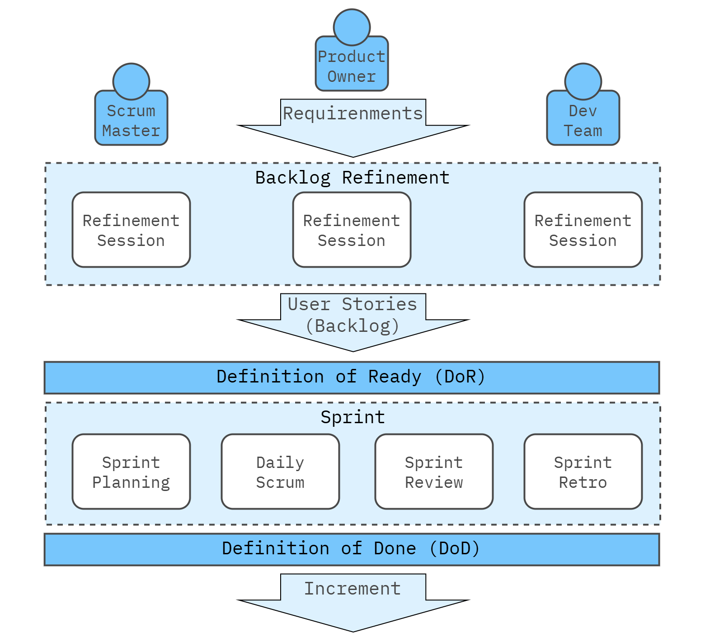



## What makes a Team?

A real team is more than just a group of people working together. Katzenbach and Smith outline several key characteristics that make a group of individuals a team. These elements distinguish a true team from a working group or committee.

<center>
   
</center>

1. **Common Purpose**: A team must have a shared and **meaningful purpose** that all members are committed to achieving. This purpose should go beyond individual goals and align with the broader organizational objectives. A clear and compelling purpose helps to unify the team and motivates them to work toward a common goal.
2. **Specific Performance Goals**: In addition to a common purpose, a team must set concrete, measurable performance goals. These goals help translate the team's purpose into actionable steps and provide a benchmark for success. Performance goals ensure that the team stays focused on delivering results.
3. **Complementary Skills**: Teams must have the **right mix of skills** to achieve their goals. These skills should be complementary, meaning that team members bring different strengths to the table, such as technical expertise, problem-solving abilities, and interpersonal skills. Teams that lack complementary skills struggle to perform at a high level.
4. **A Common Working Approach**: Teams need to establish a clear, agreed-upon approach to working together. This includes how decisions will be made, how tasks will be divided, and how team members will communicate. A defined working approach ensures the team operates efficiently and minimizes confusion or conflict.
5. **Mutual Accountability**: In a real team, members are **mutually accountable** to each other for the team’s performance. This goes beyond individual accountability and requires that every team member feels responsible for their tasks and the team's overall success. Mutual accountability fosters trust and encourages collaboration.

**Example**: The architecture team at a tech company is working on building aligned architecture for the product with a focus on modernization (**common purpose**). They set a goal to reduce the system run rate by 15% while improving the system scalability by the end of the quarter (**specific performance goals**). Each member has it's own zone of responsibility - Infrastructure, Data Platform, Presentation Layers, System Security, etc. - allowing them to cover all critical aspects (**complementary skills**). They follow an agile approach using the Kanban framework with bi-weekly reviews and reiterations on planning sessions (**common working approach**). The team is mutually accountable for the final architecture's performance, with everyone taking responsibility for both successes and challenges (**mutual accountability**).```

### Types of Teams

The book identifies different types of teams based on their roles and functions within an organization. These include:

1. **Teams That Recommend Things**: These teams are typically task forces, advisory groups, or committees. Their primary function is to **analyze problems, develop recommendations, and offer solutions**. Examples include strategy teams or problem-solving task forces. These teams face the challenge of influencing others since they usually don’t have direct implementation responsibilities.
   * **Key challenge**: The critical moment for these teams is when they hand off their recommendations to those responsible for execution. Their effectiveness depends on how actionable their recommendations are and how well they communicate their findings to decision-makers.
2. **Teams That Make or Do Things**: These are the operational teams, such as manufacturing, sales, or customer service. Their goal is to execute specific tasks or produce tangible results. These teams are often responsible for ongoing operations and are focused on achieving specific outcomes, such as product quality, customer satisfaction, or sales targets.
   * **Key challenge**: These teams often must balance their workload and improve processes. They must be able to manage themselves effectively, including resolving conflicts, developing new skills, and continually improving their performance.
3. **Teams That Run Things**: This category includes **management teams** at various levels, such as senior leadership teams or departmental leadership teams. These teams focus on **overseeing operations, setting direction, and ensuring the organization runs smoothly**.
   * **Key challenge**: Teams that run things face unique obstacles, such as dealing with hierarchical boundaries, managing multiple priorities, and handling long-term strategic decisions. Members of management teams often have strong individual responsibilities, making it harder to function as a collective team.

### The Difference Between Teams and Non-Teams

Katzenbach and Smith emphasize that not every group is a team, even if they call themselves one. Groups often fail to become real teams because they lack the discipline to follow the key elements of team performance. The authors differentiate teams from other groupings, such as:

1. **Working Groups**: These are collections of individuals who come together to share information or coordinate activities but do not have a collective purpose or shared performance goals. In working groups, individual members focus on their own areas of responsibility and performance, with little or no emphasis on mutual accountability or collaboration.
   * **Example**: A meeting of managers from different departments to update each other on their respective areas is a working group, not a team.
2. **Pseudo-Teams**: These groups may be labeled as teams but **lack the essential characteristics** of a true team. Members may meet regularly and share some responsibilities but do not fully commit to a common purpose or hold each other mutually accountable for performance. As a result, they never achieve the performance potential of a real team.
   * **Example**: A group formed to tackle a company-wide initiative but that lacks clear goals or commitment from its members can be considered a pseudo-team.
3. **Potential Teams**: Potential teams are groups on their way to becoming real teams but have not fully developed the discipline needed. They might have a common purpose and some performance goals, but they lack total commitment or haven’t yet established the mutual accountability required to perform at a high level.
   * **Example**: A task force with a defined mission but struggling with alignment on performance goals is a potential team.

### Key Characteristics that Define a Real Team

1. **Small Size**: Teams are typically **small groups**, usually composed of fewer than 20 people. Small teams allow for closer collaboration, more efficient communication, and easier coordination of efforts.
2. **Complementary Skills**: Each team member brings a unique set of skills that complement the others, creating a well-rounded group capable of addressing various aspects of the task or project.
3. **Performance Focus**: Real teams focus on **specific, measurable outcomes**, not just on teamwork for its own sake. Achieving performance goals is their primary objective.
4. **Discipline**: Teams must **consistently apply a disciplined approach** to their work, including a focus on goals, clear roles, and mutual accountability. Without this discipline, even well-intentioned groups can fall short of their potential.

### Building a team

Tuckman’s model, developed in 1965 by psychologist Bruce Tuckman, describes five stages that teams go through as they form and develop. The Tuckman model remains highly relevant in today’s collaborative environments, including corporate, academic, and community settings.

<center>
   
</center>

1. **Forming**: Team members meet and begin to understand their roles and objectives. This stage involves introductions, goal clarification, and initial team planning in project teams.
2. **Storming**: Conflicts emerge as personalities clash and power dynamics are established. Team members may disagree on strategies, roles, or project timelines. This phase often leads to improved communication and a deeper understanding of team dynamics.
3. **Norming**: The team begins to resolve differences, creating norms and fostering collaboration. Teams develop agreed-upon rules and working patterns, enabling smoother collaboration.
4. **Performing**: The team functions efficiently, focusing on achieving its goals. Collaboration is natural and efficient.
5. **Adjourning**: Once objectives are met, teams disband, celebrating success or reflecting on lessons learned.

These stages provide a framework for understanding team evolution, helping leaders guide teams through challenges to reach high performance. By recognizing the unique challenges and opportunities at each stage, leaders can foster smoother transitions and build stronger, more effective teams.

## What makes a team Agile?

An Agile team is a small, cross-functional group of usually ten or fewer individuals collaborating to deliver value to customers through iterative development cycles. These teams have all the skills necessary to define, build, test, and deploy increments of work independently without needing external help. They are self-organizing and self-managing, responsible for understanding customer needs, planning their work, delivering quality products, and continuously improving their processes. Supported by Product Owners and Scrum Masters, they work in a synchronized flow within an Agile Release Train (ART).

Key characteristics include:

1. **Cross-Functional Teams**: Agile teams comprise members with varied skill sets (development, testing, etc.), eliminating handoffs and delays. Each team can define, build, test, and deploy product features, ensuring that all required expertise is available within the team.
2. **Organized Around Value**: Agile teams are designed to focus on delivering value to the customer. Whether they are building digital solutions or business functionality, they work to provide continuous value delivery through frequent, small increments.
3. **High Performance and Collaboration**: Effective Agile teams have a clear, shared vision, trust each other, take risks without fear, and meet their commitments to deliver high-quality work. They are often part of an Agile Release Train, synchronizing with other teams to deliver comprehensive solutions.

#### Responsibilities of Agile Teams

1. **Connecting with Customers**: Agile teams are deeply customer-centric. They build empathy for customer needs and design solutions that address those needs. They engage in activities such as direct observation, using telemetry data to monitor product use, and understanding customer personas.
2. **Planning the Work**: Teams plan their own work, often engaging in Program Increment (PI) Planning sessions at the ART level to align with broader organizational goals. They break down work into manageable increments and continuously refine their backlog based on new information.
3. **Delivering Value**: Agile teams continuously integrate and test their work, ensuring quality. Depending on their operating model, they may release increments of functionality directly to customers, ensuring fast value delivery and responsiveness to feedback.
4. **Getting Feedback**: Agile teams thrive on quick and meaningful feedback from customers and technological systems. Frequent customer interaction and solution demos allow them to adjust course and improve the product incrementally.
5. **Improving Relentlessly**: Continuous improvement is a core principle. Teams regularly hold retrospectives to reflect on their work and make necessary adjustments. They proactively solve problems as they arise and constantly seek ways to optimize their workflow and output.

Agile teams structure their work using frameworks like Scrum or Kanban. Scrum encourages time-boxed iterations and regular ceremonies such as standups and retrospectives, while Kanban focuses on continuous delivery and visualizing work to optimize flow.

This approach ensures that Agile teams can deliver high-quality solutions quickly, adapt to change, and effectively meet customer needs, contributing to the overall success of their organization.

## Kanban

Kanban has gained traction as a powerful approach for managing and improving knowledge work across various sectors, including software development, manufacturing, and professional services. It focuses on visualizing work, limiting work in progress (WiP), and ensuring a smooth flow of value to customers.

### Core Values

At the heart of the Kanban method are its values, guiding organizations in pursuing effective and sustainable work practices. These values are:

1. **Respect**: Acknowledging and valuing everyone involved in the process is crucial for fostering collaboration and engagement.
2. **Transparency**: Open information sharing enhances communication and allows teams to understand workflows and challenges clearly.
3. **Collaboration**: Emphasizing teamwork and collective effort improves the overall efficiency and quality of deliverables.
4. **Customer Focus**: Understanding and prioritizing customer needs ensures that the work being done aligns with delivering value to those who matter most.
5. **Flow**: Recognizing work as a continuous flow of value helps teams visualize and manage their processes effectively.
6. **Leadership**: Encouraging leadership at all levels promotes proactive behavior and accountability within teams.
7. **Understanding**: Gaining insight into both individual and organizational performance enables informed decision-making and continuous improvement.
8. **Balance**: Striking a balance among different viewpoints and capabilities is essential for effective workflow and problem-solving.
9. **Agreement**: Fostering commitment toward shared goals while respecting differing opinions promotes a culture of continuous improvement.

### Principles

Kanban is built on several foundational principles that guide its implementation and practices:

##### Change Management Principles

1. **Start with What You Do Now**: Organizations should begin by understanding their current processes and respecting existing roles and responsibilities. This reduces resistance to change and sets a solid foundation for improvement.
2. **Pursue Evolutionary Change**: Continuous, incremental improvements are encouraged rather than radical overhauls. This principle helps organizations adapt gradually while learning from their experiences.
3. **Encourage Leadership at All Levels**: Everyone, from individual contributors to management, should engage in leadership to foster a culture of accountability and empowerment.

##### Service Delivery Principles

1. **Understand Customer Needs**: Focus on customers' requirements and expectations to ensure that the services delivered are fit for purpose.
2. **Manage Work, Let People Self-Organize**: Teams should have the autonomy to organize their work while adhering to established processes and policies.
3. **Evolve Policies to Improve Outcomes**: Policies should be adaptable and regularly reviewed to enhance service delivery and customer satisfaction.

### Implementation of Kanban

Implementing Kanban involves several key steps and practices that help teams transition to this method effectively:

1. **Visualizing Work**: The first step in implementation is creating a Kanban board. This board serves as a visual representation of work items and their statuses, allowing teams to see the flow of work and identify bottlenecks easily. The board typically consists of columns representing different workflow stages, with cards (representing work items) moving through these stages.
2. **Limiting Work in Progress (WiP)**: By setting WiP limits, teams can prevent overloading their capacity and focus on completing tasks before taking on new ones. This pull system ensures that work is only initiated when there is available capacity, promoting efficiency and reducing lead times.
3. **Managing Flow**: Monitoring the flow of work is critical to identifying and addressing issues that impede progress. Teams should regularly assess their processes, look for bottlenecks or blockers, and adapt to ensure a smooth workflow.
4. **Making Policies Explicit**: Documenting and displaying policies related to workflows helps create transparency and clarity. This includes defining what constitutes “done,” establishing criteria for moving work items between stages, and setting rules for prioritizing tasks.
5. **Implementing Feedback Loops**: Regular feedback is essential for continuous improvement. Teams should establish cadences for meetings to discuss performance metrics, address concerns, and collaboratively identify areas for improvement. This could include daily stand-ups, retrospectives, and planning sessions.
6. **Evolving Experimentally**: Kanban encourages teams to adopt an experimental mindset, allowing them to test new practices and refine existing ones based on the outcomes. This iterative approach fosters a culture of innovation and resilience.

### Events and Meetings Structure

A structured approach to events and meetings is integral to the Kanban method, helping teams maintain communication, evaluate progress, and promote continuous improvement. Here are the key meetings commonly associated with Kanban:

<center>
   
</center>

1. **Strategy Review**: The Strategy Review meeting is focused on selecting the services to be provided and defining the concept of “fit for purpose” for those services. It helps teams sense how the external environment changes, allowing them to adapt their service offerings and provide clear direction for future efforts.
2. **Operations Review**: The Operations Review meeting aims to understand the balance between and across services. It assesses resource deployment to maximize value delivery while ensuring alignment with customer expectations and facilitates discussions on improving overall service efficiency.
3. **Risk Review**: The Risk Review is dedicated to understanding and responding to the risks associated with effective service delivery. This meeting typically involves identifying blockers and clustering them to proactively address potential issues, ensuring teams can navigate challenges effectively.
4. **Service Delivery Review**: The Service Delivery Review focuses on examining and improving the effectiveness of a specific service. This meeting looks at performance metrics, customer feedback, and potential enhancements to ensure that the service continues to meet or exceed expectations.
5. **Replenishment Meeting**: The Replenishment Meeting is essential for moving items over the commitment point and into the workflow system. It oversees the preparation of options for future selections, ensuring that the backlog remains aligned with the team’s capacity and priorities.
6. **Kanban Meeting**: Often held daily, the Kanban Meeting is a coordination and self-organization session for those collaborating to deliver the service. Utilizing a stand-up format encourages a short, energetic meeting focused on completing work items and addressing any blockers that may impede progress.
7. **Delivery Planning Meeting**: The Delivery Planning Meeting is designed to monitor and plan deliveries to customers. This meeting helps teams align their efforts with customer needs, ensuring that the right products and services are delivered on time and following customer expectations.

### Conclusion

Kanban is more than just a workflow management tool; it is a comprehensive method emphasizing values and principles essential for successful knowledge work. By understanding and implementing Kanban’s core values and foundational principles, organizations can create a culture of continuous improvement, enhance collaboration, and deliver greater value to their customers. The structured events and meetings within Kanban further promote communication, transparency, and a focus on improvement. The journey to mastering Kanban is ongoing, but with each step, teams can achieve higher efficiency and responsiveness in their work.

## Scrum

Scrum is a widely adopted framework for agile project management, particularly in software development. It provides a structured approach to delivering high-quality products through iterative processes and teamwork.

### Core Values 

Scrum is grounded in core values shaping its practices and guiding teams in pursuing successful project outcomes. These values are:

1. **Commitment**: Team members are dedicated to achieving their goals and supporting one another. This commitment fosters a culture of responsibility and accountability.
2. **Courage**: Scrum encourages team members to tackle challenging problems and express their ideas, ensuring that issues are addressed transparently.
3. **Focus**: Teams concentrate on the work at hand, maximizing their productivity and ensuring that they deliver value during each Sprint.
4. **Openness**: Transparency in processes, progress, and challenges promotes trust among team members and stakeholders, enhancing collaboration and communication.
5. **Respect**: Team members respect each other’s skills, experiences, and contributions, fostering an environment where everyone feels valued and empowered to contribute.

{{- MD024 -}}

### Principles 

Scrum is built on several principles that guide its practices and processes:

1. **Empirical Process Control**: Scrum operates on the foundation of transparency, inspection, and adaptation. Teams regularly review progress and adapt their processes based on real data and feedback.
2. **Self-Organization**: Teams are self-managing, deciding how to accomplish their work without external direction. This autonomy fosters creativity and empowers team members to take ownership of their tasks.
3. **Collaboration**: Scrum promotes close collaboration between team members, stakeholders, and customers, ensuring everyone is aligned and working toward a common goal.
4. **Time-Boxing**: Scrum employs time-boxed events to create a sense of urgency and focus. These events help teams maintain momentum and ensure consistent progress.

### Implementation of Scrum

Implementing Scrum involves several key roles, events, and artifacts that help teams organize their work effectively:

<center>
   
</center>

##### Key Roles in Scrum

1. **Scrum Master**: The Scrum Master is a facilitator who helps the team understand and apply Scrum practices. They remove impediments, coach team members, and ensure the Scrum framework is followed.
2. **Product Owner**: The Product Owner is responsible for maximizing the value of the product. They manage the product backlog, prioritize work items, and ensure the team works on the most valuable tasks.
3. **Development Team**: The Development Team is composed of professionals who work together to deliver incremental product releases. They are cross-functional and possess all the skills necessary to complete the work.

##### Scrum Events

Scrum is structured around six key events that provide a framework for teams to plan, execute, and review their work:

1. **Backlog refinement**: Backlog refinement is the continuous process of clarifying, prioritizing, and breaking down backlog items to ensure they are ready for development, aligning the team's work with product goals and upcoming sprint needs. Although not a formal Scrum event, many teams hold regular backlog refinement sessions—often mid-sprint—to collaboratively review and prepare backlog items for the next sprint. This ongoing activity keeps the backlog organized, actionable, and focused on delivering value.
2. **Sprint**: A Sprint is a time-boxed period, typically lasting between one and four weeks, during which the team works to complete a set of backlog items. Each Sprint begins with a Sprint Planning meeting and ends with a Sprint Review and Retrospective.
3. **Sprint Planning**: This meeting kicks off the Sprint, where the team collaboratively selects items from the product backlog to work on during the Sprint. The team defines the Sprint Goal and creates a plan for delivering the selected items.
4. **Daily Scrum**: Also known as the daily stand-up, this 15-minute meeting allows team members to synchronize their work, discuss progress, and identify any impediments. It promotes transparency and keeps the team focused on the Sprint Goal.
5. **Sprint Review**: At the end of each Sprint, the team presents the completed work to stakeholders during the Sprint Review. This event provides an opportunity for feedback, ensuring that the product aligns with customer expectations and market needs.
6. **Sprint Retrospective**: After the Sprint Review, the team holds a Retrospective to reflect on their performance during the Sprint. They discuss what went well and what could be improved and identify actionable steps for enhancing their processes in the next Sprint.

##### Scrum Techniques

Scrum utilizes specific techniques to provide transparency and facilitate communication:

1. **Product Backlog**: The Product Backlog is an ordered list of all desired work on the project. It serves as a single source of truth for the team and is continuously refined to ensure it reflects the current priorities and requirements.
2. **Sprint Backlog**: The Sprint Backlog is a subset of the Product Backlog that the team commits to completing during a Sprint. It includes the selected items and the plan for delivering them.
3. **Increment**: The Increment represents the sum of all completed work items at the end of a Sprint. Each Increment should meet the Definition of Done, ensuring that it is potentially shippable and provides value to the customer.
4. **Definition of Ready (DoR)**: The Definition of Ready is a checklist or set of prerequisites that a Product Backlog Item or user story must satisfy before being accepted into a Sprint. It ensures that the work is well-defined, actionable, and sufficiently prepared for the development team to begin implementation without ambiguity.
5. **Definition of Done (DoD)**: The Definition of Done is a formalized set of criteria agreed upon by the Scrum Team that determines when a Product Backlog Item, user story, or product increment is considered complete. It ensures that the work is of sufficient quality, meets all specified requirements, and is potentially shippable or usable by the end user.

### Conclusion

Scrum is a powerful framework that enables teams to deliver high-quality products through structured collaboration, transparency, and continuous improvement. By embracing Scrum's core values and principles, teams can create a productive and engaging work environment that fosters innovation and adaptability. Scrum's defined roles, events, and artifacts provide a clear roadmap for teams to navigate their projects effectively. With its focus on iterative progress and stakeholder engagement, Scrum empowers organizations to meet the market's ever-changing demands while delivering value to their customers.

## Recommended Reading

#### Web Resources

* [Tuckman's stages of group development](https://en.wikipedia.org/wiki/Tuckman%27s_stages_of_group_development)
* [Agile Teams](https://scaledagileframework.com/agile-teams/)
* [Kanban Essentials](https://kanbanbooks.com/essential-kanban-condensed/)
* [Scrum Guide](https://scrumguides.org/scrum-guide.html)

#### Books

* Katzenbach, J. R., & Smith, D. K. [The wisdom of teams: Creating the high-performance organization](https://hbsp.harvard.edu/product/15042-PDF-ENG). Harvard Business School Press, 1993.
  * **Part I**\
    Part 1 explains the importance of teams in organizations, emphasizing that teams outperform individuals when tasks require diverse skills and collaboration. It introduces the basic elements of a successful team, including a common purpose, performance goals, complementary skills, and mutual accountability. The section also highlights the challenges teams face and outlines the difference between true teams and non-team groups, like working groups or pseudo-teams.
  * **Part II**\
    Part 2 focuses on how groups evolve into real teams by progressing along the "team performance curve." It discusses the stages of team development, from working groups to high-performance teams, emphasizing the importance of moving from individual accountability to collective performance. The section also explores the critical role of team leaders, who must facilitate collaboration rather than dominate, and offers strategies for overcoming common obstacles that teams face during their development.
* Anderson, David J., and Carmichael, Andy. [Essential Kanban Condensed](https://kanbanbooks.com/essential-kanban-condensed/). Kanban University Press, 2016.
  * Essential Kanban Condensed by David J. Anderson and Andy Carmichael provides a concise overview of the Kanban method, emphasizing its application in managing and improving knowledge work. The book outlines the Kanban method's core values, foundational principles, and essential practices, such as visualizing work, limiting work in progress (WiP), and fostering a culture of continuous improvement. Additionally, it offers practical guidance for implementing Kanban effectively within organizations, promoting transparency, collaboration, and adaptability to enhance overall efficiency.
