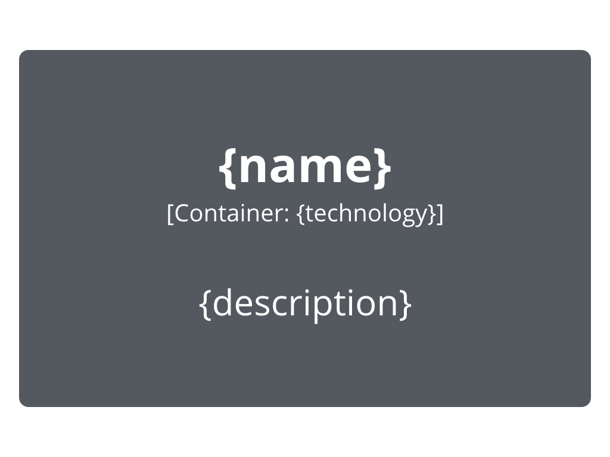

## Introduction

The **C4 Model** focuses on clarity and simplicity in representing software architecture. Its notation is designed to make diagrams easily understandable for technical and non-technical audiences. While C4 is notation-agnostic, it encourages a consistent and minimalistic approach emphasizing essential details over complexity. Here's a breakdown of the core elements in C4 notation and their roles in creating practical architectural diagrams.

---

## Core Elements

* **People (Actors)**:
  * Represented by a **stick figure** or a labeled box, depending on the medium.
  * **Purpose**: Depict the individuals, roles, or personas interacting with the software system.
  * **Examples**: End users, administrators, external clients, or other stakeholders.

  
   
  <a href="https://c4model.com/diagrams/notation" style="padding-left: 60px;">
    <small>Source: https://c4model.com/</small>
  </a>
    

* **Software Systems**:
  * Represented as **large labeled boxes**.
  * **Purpose**: Highlight the primary systems, applications, or services involved.
  * **Types**:
    * **Internal Systems**: The systems being designed or managed.
    * **External Systems**: Third-party or legacy systems interacting with the internal system.

  
   
  <a href="https://c4model.com/diagrams/notation" style="padding-left: 60px;">
    <small>Source: https://c4model.com/</small>
  </a>
    

* **Containers**:
  * Represented as **nested boxes** within a Software System.
  * **Purpose**: Break down a system into significant building blocks that execute its functionality, such as applications, APIs, or databases.
  * **Examples**: A web application, a mobile app, a microservice, or a database.

  
   
  <a href="https://c4model.com/diagrams/notation" style="padding-left: 60px;">
    <small>Source: https://c4model.com/</small>
  </a>
    

* **Components**:
  * Represented as **smaller boxes inside Containers**.
  * **Purpose**: Detail the internal structure of containers, identifying major responsibilities and their interactions.
  * **Examples**: A service module, a controller, or a library within a microservice.

  
   
  <a href="https://c4model.com/diagrams/notation" style="padding-left: 60px;">
    <small>Source: https://c4model.com/</small>
  </a>
    

* **Relationships**:
  * Represented as **arrows** between elements, with labels describing the nature of the interaction.
  * **Purpose**: Illustrate how people, systems, containers, and components communicate or share data.
  * **Examples**: HTTP requests, database queries, or message-passing mechanisms.

  
   
  <a href="https://c4model.com/diagrams/notation" style="padding-left: 60px;">
    <small>Source: https://c4model.com/</small>
  </a>
    

---

### Key Attributes

* **Labels and Annotations**:
  * Each element is labeled with a **clear and concise description**.
  * Relationships are annotated to explain their purpose or data exchanged.
* **Color and Visual Distinction**:
  * While C4 is minimalistic, **color coding** or shading can differentiate element types or emphasize specific parts of the diagram.
  * **Examples**: Using one color for external systems and another for internal ones.
* **Simple and Flexible Shapes**:
  * Avoid overly complex symbols; simple rectangles, arrows, and stick figures suffice.
  * The goal is accessibility, whether the diagram is drawn on a whiteboard or using diagramming tools.
* **Legend or Key**:
  * Each diagram includes a **legend** explaining the notation used, ensuring it is self-explanatory even for new viewers.
* **Minimalism**:
  * Unnecessary details are avoided. The diagrams focus only on the elements relevant to the level of abstraction being presented (e.g., Context, Container, Component).

---

### How These Elements Interact

C4 diagrams are hierarchical, with elements at each level of abstraction building on those in the previous level. For example:

* On the first level, only People and Software Systems are shown, depicting the system's external environment.
* On the second level, the focus shifts to the internal structure of a single Software System, introducing Containers and their relationships.
* On the third level, the focus moves deeper into a specific Container, showcasing its internal Components and their interactions.

---

### Benefits of C4 Notation

* **Clarity Across Audiences**:
  * C4’s focus on simplicity ensures diagrams are understandable by both technical teams and business stakeholders.
* **Adaptability**:
  * It works well with digital tools or physical whiteboarding, making it versatile for various workflows.
* **Focus on Essentials**:
  * By emphasizing only the most critical elements at each level, C4 notation prevents diagrams from cluttering.

## Recommended Reading

#### Articles

* Brown, S. *["C4 Notation"](https://c4model.com/diagrams/notation)*.
  Detailed description of the C4 Notation.
