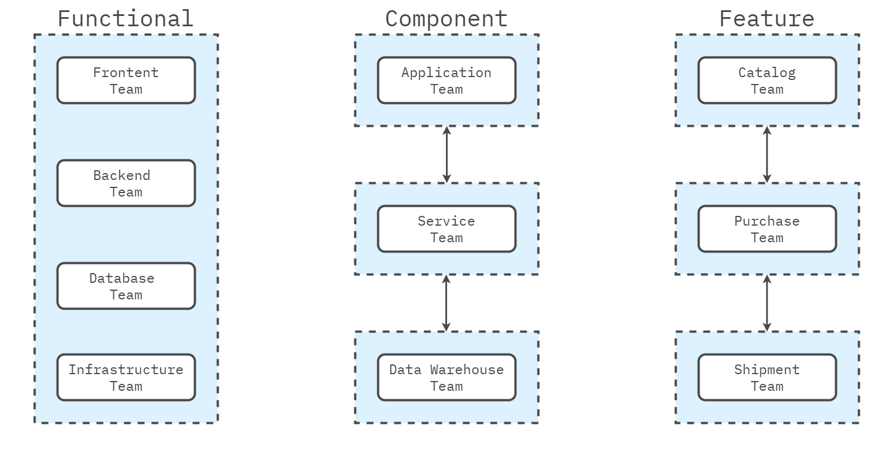
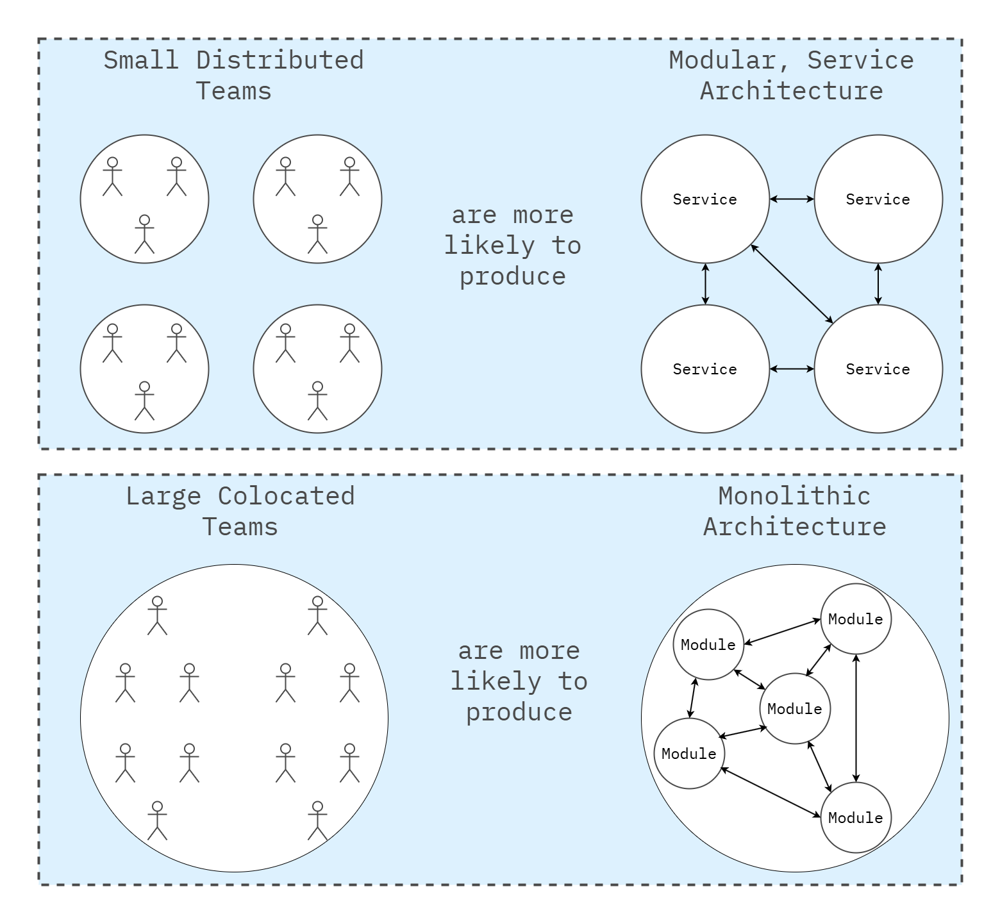
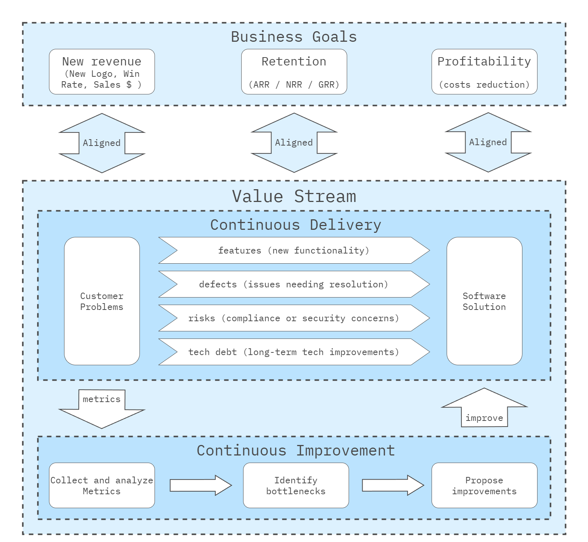
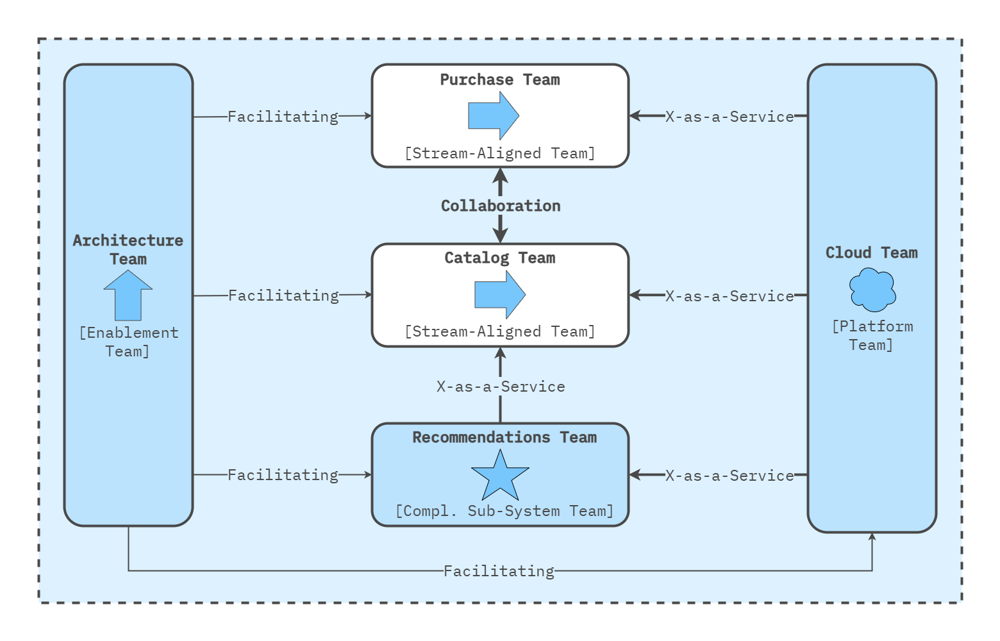
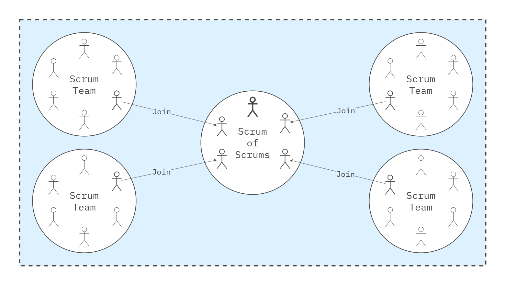
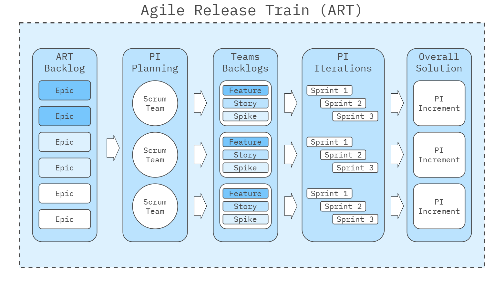
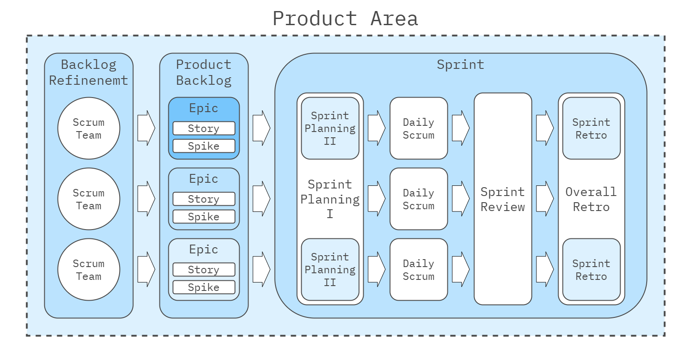
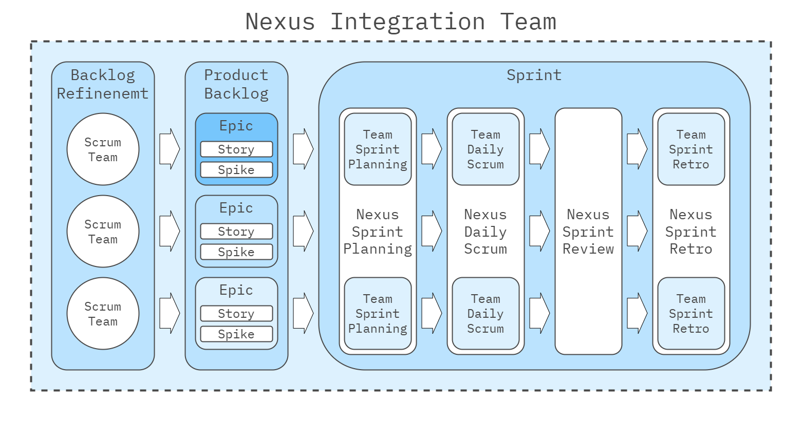

## Introduction

As your product and company grow, it becomes increasingly necessary for the organizational structure to evolve. It's no longer feasible for a single team to handle the entire delivery process from end to end. While this might work early, scaling beyond one team introduces significant challenges. Over time, different approaches have been used to manage this complexity.

Initially, with monolithic architectures, companies relied on functional teams. This approach, while it had its limitations, also had its benefits. Each team was responsible for a specific layer of the monolith, allowing for a clear division of labor and expertise.

For example:

* The **frontend team** managed the presentation layer.
* The **backend team** handled business logic and persistence.
* The **infrastructure or database team** managed the database layer.

However, new organizational challenges emerged as software architectures evolved toward **distributed systems** and especially **microservices**. In **microservices architecture**, there are multiple independent components. To manage this, organizations shifted to **component teams**. Each team owned and supported specific microservices from end to end, including development, testing, and deployment. While this approach offered some advantages, like clear ownership and specialization, it also introduced significant dependencies between teams. For example, delivering a feature often requires coordination across several teams, leading to delays and handovers.

To address these challenges, companies began experimenting with **feature teams** . In theory, a feature team is structured to take a feature and deliver it end to end without relying on other teams. The goal is to reduce dependencies and handovers. However, in practice, implementing feature teams in a **microservices environment** is challenging. For instance, a feature may require changes to multiple services—some of which the team has never worked on before—leading to inefficiencies and bottlenecks.

The **functional team** and **component team** approaches have advantages. Still, they also have significant downsides, particularly in dependencies and the coordination required to deliver features to customers efficiently. **Feature teams** attempt to solve these problems but often face hurdles in complex, large-scale microservices environments.

   

---

## Department Structure

Several new frameworks and approaches have been developed to address the challenges of aligning organizational structures with effective software delivery. One of the most important concepts is **Conway's Law**, which states that an organization's structure and software architecture are so tightly coupled that they inevitably mirror each other. This insight leads to the realization that we should organize teams in a way that reflects how we want the architecture to look. At the same time, we should design the architecture so that feature teams can effectively deliver it.

Another key concept is the **value stream**. A value stream represents a product, service, or part of a product/service that delivers distinct value to customers. We can create independent units operating autonomously by organizing teams and architecture around value streams. This brings up several important questions:

* **How do we identify value streams?** This is typically done through **Value Stream Mapping**, which helps visualize and analyze the workflow.
* **How do we organize value streams?** The answer lies in the **Team Topologies framework**, which guides structuring teams to align with value streams.
* **How do we implement value streams?** Several Agile frameworks, such as **Scrum@Scale** , **SAFe** , **LeSS** and **Nexus** , offer methods to manage and operationalize value streams effectively.

### What is Conway’s Law?

**Conway’s Law** is an observation made by computer scientist Melvin Conway in 1968, stating that:

> **Organizations that design systems are constrained to produce designs that are copies of the communication structures of these organizations.**

In simpler terms, how teams communicate and collaborate significantly shapes the design of the systems they create. A company's organizational structure directly influences the architecture and structure of the software or systems it produces.

   

##### Key Insights from Conway's Law

1. **Systems Reflect Communication Patterns**: The architecture of software systems tends to mirror the social and communication structures of the teams that build them. The resulting software will likely have siloed or fragmented components if teams are siloed or fragmented.
2. **Team Structure Affects Product Structure**: How teams are organized—whether by function (e.g., development, testing, operations) or around specific products—leads to certain architectural decisions in the software. For example, if separate teams work on frontend and backend development, the software will likely have a distinct separation between those layers.
3. **Tight Collaboration Leads to Integrated Systems**: When teams work closely together, the systems they produce tend to be more integrated and cohesive. However, when teams are fragmented or have inefficient communication, the resulting systems are often disjointed or difficult to maintain.

##### Why is Conway’s Law Important?

1. **Organizational Design Influences Software Architecture**:
   * Understanding Conway’s Law helps leaders realize that team structures and communication pathways are not just HR or organizational concerns—they directly affect the quality and maintainability of software.
   * It emphasizes aligning team structures with the desired software architecture. For example, if a business wants a highly modular, decoupled software architecture, it needs to organize teams to promote modularity and independence.
2. **The Reverse Conway Maneuver**:
   * This concept suggests that rather than letting the current team structure dictate software design, organizations can **deliberately design teams** to reflect the desired software architecture.
   * The system's design will naturally follow this structure by reorganizing teams to mirror the architecture the organization aims for (e.g., microservices). This leads to better alignment between the product and how the teams operate.
3. **Impact on Communication**:
   * Conway’s Law highlights the importance of effective communication between teams. The resulting system will reflect that complexity if communication is fragmented or too complex. This can lead to inefficiencies, redundancies, or system development delays.
   * Encouraging collaboration, clear boundaries, and defined team interactions helps streamline the organizational workflow and the software systems it produces.
4. **Application in Agile and DevOps**:
   * Conway’s Law is especially relevant in Agile and DevOps environments, where cross-functional, autonomous teams are encouraged. Organizations can improve the speed and quality of software delivery by creating stream-aligned, product-focused teams.
   * As teams are designed around the flow of work or specific value streams, optimizing system performance and maintaining smooth workflows from concept to deployment becomes easier.
5. **Reducing Complexity**:
   * A poorly organized company will naturally create overly complex systems. By simplifying team structures, organizations can reduce the complexity of their software architectures. This, in turn, makes systems more suitable to develop, test, deploy, and maintain.

##### Real-World Example of Conway’s Law in Action

**Microservices Architecture**: Team structures have evolved in many organizations adopting microservices to mirror this approach. A dedicated, autonomous team often builds and maintains each service (or group of services). This enables each team to work independently on their microservice without affecting the others, enhancing system scalability and flexibility. This is a practical application of the reverse Conway maneuver—shaping team structures to achieve a specific software architecture.

### What is Value Stream?

A **Value Stream** is the end-to-end sequence of activities required to deliver a product, service, or solution to a customer, starting from the initial concept and continuing through to delivery and ongoing support. It encompasses all the processes involved in creating, developing, and delivering value, engaging cross-functional teams, tools, and systems to ensure that value continuously flows to the customer.

**Key Components of a Value Stream:**

1. **Flow of Work**: A value stream involves different types of work, such as features (new functionality), defects (issues needing resolution), risks (compliance or security concerns), and technical debt (long-term technical improvements).
2. **Continuous Delivery**: Value streams are dynamic and evolve. Rather than focusing on the completion of individual projects, they emphasize the continuous and iterative delivery of value to the customer.
3. **Continuous Improvement**: To optimize value streams, organizations track the flow of work using metrics such as flow velocity (how much work is completed), flow time (how long work takes to move through the stream), and flow efficiency (the balance between active work and waiting time). This visibility enables the identification of bottlenecks and opportunities for improvement.
4. **Customer-Centric Focus**: A value stream is designed with the customer at the center, ensuring that every activity and process is aligned to deliver outcomes that meet customer needs and add tangible value.
5. **Alignment with Business Goals**: Value streams align with the organization’s broader business objectives, ensuring that all efforts are focused on delivering measurable results that support strategic goals.

   

##### What is Value Stream Mapping?

**Value Stream Mapping** (VSM) is a structured exercise for visualizing, analyzing, and improving the flow of materials, information, or work through a system. Its primary goal is to identify the steps required to deliver value to the customer, including all value-added and non-value-added activities. By mapping out the current process, organizations can pinpoint inefficiencies, bottlenecks, and waste that hinder value delivery. The exercise is widely used in Lean manufacturing, software development, and other industries to streamline processes and increase efficiency.

##### Value Stream Mapping to Identify Value Streams

When applied to identify value streams, Value Stream Mapping helps organizations visualize how value is delivered to the customer across various stages, from product conception to delivery. It involves mapping out the current workflow within an organization to identify distinct **value streams** — the sequence of activities and processes that result in a product, service, or feature providing value to the customer.

##### Independent Service Heuristics (ISH) Method for Identifying Value Streams

The **[Independent Service Heuristics (ISH)](https://teamtopologies.com/key-concepts-content/finding-good-stream-boundaries-with-independent-service-heuristics)** method is a practical approach designed to help organizations identify good value streams and team boundaries to improve flow and efficiency. It is a complementary tool to **Domain-Driven Design (DDD)** and is particularly effective for evaluating and discovering service boundaries without needing deep engineering expertise.

##### Key Steps in the ISH Method

1. **Select Candidate Areas**: Start by identifying potential services, products, or domains within your organization that could represent value streams. These should be areas where work is done, or value is delivered to the customer.
2. **Apply Heuristics to Evaluate Independence**:
   * Assess each candidate with questions such as:
     * Could this function independently as a service?
     * Does it have a well-defined customer base or user personas?
     * Can it be managed separately regarding cost, data, and infrastructure?
     * Would consumers value it as a standalone offering?
3. **Evaluate for Clear Boundaries**: Review whether each potential value stream can operate with minimal dependencies on other parts of the organization. The more self-contained and independent it is, the better it serves as a value stream.
4. **Refine Based on Business Impact**: Determine whether each candidate provides enough value or presents an engaging challenge for teams. The value stream should have enough scope to justify a dedicated team responsible for its full lifecycle.
5. **Validate with Teams and Adjust Boundaries**: After identifying potential streams, validate them by testing whether teams can independently manage these areas. Adjust the boundaries to ensure they align with organizational goals and customer needs.

##### Outcome

The ISH method helps define **stream-aligned teams** responsible for delivering distinct value to customers. This alignment leads to faster, more autonomous workflows and reduces organizational bottlenecks and dependencies.

### What Are Team Topologies?

**[Team Topologies](https://teamtopologies.com/)** is a framework developed by Matthew Skelton and Manuel Pais that provides a structured approach to organizing teams to maximize the flow of value and improve collaboration. It focuses on designing team structures that support fast and efficient software delivery while minimizing complexity and reducing cognitive load on teams. Team Topologies helps organizations create teams aligned with business goals and deliver value quickly and continuously.

The model defines **four fundamental team types** and **three modes of team interaction**, which help ensure that teams are designed and interact to support the flow of work through the organization.

   

##### The Four Fundamental Team Types

1. **Stream-Aligned Teams**:
   * These teams are aligned with a specific value stream, such as a product, service, or customer journey.
   * They have end-to-end responsibility for delivering value, from design to deployment, and are optimized for a fast, continuous flow of work.
2. **Enabling Teams**:
   * These teams help others, particularly stream-aligned teams, improve their capabilities. They may introduce new technologies or practices.
   * Their purpose is to reduce bottlenecks and support the success of stream-aligned teams without taking over their work.
3. **Complicated-Subsystem Teams**:
   * These teams manage complex subsystems that require specialized knowledge. They handle areas that are too complicated for a typical stream-aligned team to manage alone.
   * This allows stream-aligned teams to focus on delivering value without getting bogged down by highly technical, complicated components.
4. **Platform Teams**:
   * Platform teams provide foundational services, infrastructure, and tools to other teams, reducing their cognitive load and allowing them to focus on delivering customer value.
   * A well-designed platform helps other teams be self-sufficient and reduces the complexity of managing infrastructure.

##### The Three Modes of Team Interaction

1. **Collaboration**: Teams work together closely for a period of time to solve complex problems or innovate.
2. **X-as-a-Service**: One team provides a service (e.g., platform services) to another, which consumes it without understanding its inner workings.
3. **Facilitating**: An enabling team temporarily helps another team improve their skills or adopt new technologies.

##### Key Principles in Team Topologies

1. **Optimize for Fast Flow**:
   * The primary goal of Team Topologies is to optimize the flow of value to the customer. This means structuring teams and their interactions to minimize bottlenecks, delays, and unnecessary dependencies.
2. **Minimize Cognitive Load**:
   * Each team should have a manageable cognitive load. By minimizing what each team needs to worry about (for example, offloading infrastructure concerns to platform teams), teams can focus on their core responsibilities and excel in their specific areas.
3. **Conway’s Law**:
   * Team Topologies heavily references Conway’s Law, which states that systems reflect the communication structures of the teams that build them. The framework encourages organizations to align their teams with the desired architecture of their systems to ensure they work efficiently.
4. **Loosely Coupled Teams**:
   * Teams should be designed to work independently, reducing cross-team dependencies that can slow down work flow. This allows for greater autonomy and faster decision-making within teams.

##### Relationship Between Team Topologies and Value Streams

A **value stream** represents the end-to-end flow of work that delivers value to a customer, from the initial concept through development, production, and delivery. Team Topologies provide a structured approach to organizing teams around these value streams to ensure optimal flow.

Here’s how Team Topologies is related to value streams:

1. **Stream-Aligned Teams and Value Streams**:
   * Stream-aligned teams are explicitly designed around value streams. These teams are responsible for delivering a specific product or service, ensuring they can work independently and efficiently within their assigned value stream.
   * This alignment reduces dependencies and handoffs, enabling the team to fully own their value stream, from development to customer delivery.
2. **Supporting Fast Flow in Value Streams**:
   * Team Topologies aim to enable a fast flow of work, much like value streams seek to optimize the flow of value from the organization to the customer. By designing teams that align with the stages of a value stream, organizations can reduce bottlenecks, eliminate waste, and improve time to market.
3. **Platform and Enabling Teams Support Value Streams**:
   * Platform and enabling teams play a critical role in supporting stream-aligned teams focused on value streams. Platform teams provide the necessary infrastructure and tools, ensuring that stream-aligned teams can focus solely on delivering value rather than worrying about operational concerns.
   * Enabling teams, on the other hand, work to boost the capabilities of stream-aligned teams, helping them overcome challenges or adopt new technologies that will improve the flow of the value stream.

---

## Agile Frameworks

Agile frameworks help organizations scale and implement Agile methodologies across multiple teams and departments while maintaining flexibility, collaboration, and customer focus. Here are four popular Agile frameworks:

1. **[Scrum@Scale](https://www.scrumatscale.com/scrum-at-scale-guide-online/)**: Scrum@Scale is designed to help organizations scale Scrum while preserving the framework's core principles. It introduces two key cycles—the Scrum Master Cycle and the Product Owner Cycle—that work together to coordinate multiple teams. The framework emphasizes decentralized decision-making and flexibility, allowing teams to scale without adding unnecessary complexity.
2. **[SAFe (Scaled Agile Framework)](https://scaledagileframework.com/)**: SAFe integrates Agile, Lean, and DevOps practices to help large enterprises scale Agile across multiple teams, programs, and portfolios. It offers four configurations (Essential, Large Solution, Portfolio, and Full SAFe) to adapt to different levels of organizational complexity. SAFe introduces additional roles, such as the Release Train Engineer, and a structured approach to align business strategy with Agile execution.
3. **[LeSS (Large-Scale Scrum)](https://less.works/less/framework)**: LeSS is a lightweight framework designed to scale Scrum for up to eight teams working on the same product. It emphasizes simplicity by minimizing extra roles and processes, keeping the focus on maintaining Scrum's core values. LeSS encourages cross-functional feature teams and continuous collaboration to deliver an integrated product increment.
4. **[Nexus](https://www.scrum.org/resources/nexus-guide)**: Nexus scales Scrum for 3 to 9 teams working on a single product, focusing on managing cross-team dependencies and integration. It introduces the Nexus Integration Team and Nexus Daily Scrums to ensure that work across teams is continuously integrated into a cohesive product. Nexus adds minimal complexity to the existing Scrum framework, making it a lightweight option for scaling.

### Scrum@Scale

**[Scrum@Scale](https://www.scrumatscale.com/scrum-at-scale-guide-online/)** is a framework designed to help organizations scale Scrum across multiple teams, departments, or the entire enterprise while maintaining the core principles of Scrum. It was created by Jeff Sutherland, one of the co-creators of Scrum, to address the challenges faced by organizations that are growing their agile practices beyond a single team.

Scrum@Scale aims to enable agility at scale by maintaining Scrum's simplicity and flexibility, focusing on decentralized decision-making, and ensuring that organizations can grow without losing the ability to innovate or deliver high-quality products quickly.

   

##### Key Concepts of Scrum@Scale

1. **Modular Approach**: Scrum@Scale is designed to be modular, meaning organizations can apply and implement parts of the framework based on their needs. Teams can adopt components progressively and adapt to their specific contexts without overhauling their entire process.
2. **Two Cycles**:
   * **The Scrum Master Cycle**: This cycle focuses on scaling the "how" of Scrum, ensuring continuous improvement, process facilitation, and removal of impediments. It helps coordinate teams and ensures they work efficiently and effectively together.
   * **The Product Owner Cycle**: This cycle focuses on scaling the "what" of Scrum, ensuring the alignment of the vision, roadmap, and product goals across all teams. It is responsible for managing the [flow of work and prioritizing features or product requirements in line with organizational goals.
3. **Scrum of Scrums (SoS)**: A mechanism to scale coordination across multiple Scrum teams. Representatives from each Scrum team participate in regular Scrum of Scrums meetings to align on progress, identify cross-team dependencies, and address any issues that could block delivery.
4. **Executive Action Team (EAT)**: This team is responsible for removing systemic impediments and making decisions at the organizational level. It provides leadership, governance, and support for scaling efforts and ensures that the framework aligns with organizational goals and strategy.
5. **Executive MetaScrum (EMS)**: This is a leadership group that acts like the Product Owner for the organization, providing clarity, priorities, and vision across different teams and departments. It helps align the strategic initiatives with the execution efforts.
6. **Scale-Free Architecture**: Scrum@Scale allows organizations to grow or shrink the number of teams without altering the structure fundamentally. The framework is adaptable to teams of different sizes, product types, or market demands, helping organizations remain agile and flexible as they scale.
7. **Backlog Refinement at Scale**: Scrum@Scale ensures that product backlogs are refined and prioritized across multiple teams to ensure they deliver value collaboratively and systematically. This is typically done through multi-tiered backlogs, with top-level priorities trickling down to individual team backlogs.
8. **Cross-Team Collaboration**: The framework promotes strong collaboration across teams through frequent communication and the removal of silos. This ensures that knowledge, resources, and solutions are shared effectively, avoiding redundancy or inefficiency.

##### Benefits of Scrum@Scale

1. **Agility at Scale**: The ability to scale Scrum without losing the core agile principles of transparency, inspection, and adaptation.
2. **Decentralized Decision-Making**: Empowers teams to make decisions that directly impact their work, improving speed and reducing bottlenecks.
3. **Flexibility**: Scrum@Scale can be customized to the unique needs of an organization, allowing for a tailored implementation.
4. **Coordination and Alignment**: Ensures that multiple teams can work together in a coordinated fashion to deliver value to customers.

##### Comparison with Other Scaled Frameworks

While frameworks like SAFe (Scaled Agile Framework), LeSS (Large-Scale Scrum), and Nexus are also designed for scaling Scrum, Scrum@Scale is often seen as more lightweight and modular, focusing on decentralization and flexibility over prescriptive processes.

In summary, Scrum@Scale provides a framework for organizations to expand agile practices across multiple teams while preserving Scrum's core values. It focuses on efficient coordination, empowered teams, and flexibility, allowing organizations to adapt as they scale.

### SAFe

**[SAFe (Scaled Agile Framework)](https://scaledagileframework.com/)** is a popular framework designed to help large organizations scale agile practices across multiple teams, departments, and enterprises. SAFe combines principles from Agile, Lean, and DevOps to improve productivity, quality, and employee engagement while enabling fast and continuous value delivery at scale.

Dean Leffingwell introduced SAFe in 2011. It has evolved into a comprehensive framework that provides a structured approach for scaling agile methodologies like Scrum or Kanban from the team level to enterprise-wide levels.

   

##### Key Components of SAFe

1. **Core Principles**:
   * **Lean-Agile Mindset**: SAFe promotes a mindset rooted in Lean thinking and Agile principles, encouraging organizations to focus on delivering value quickly and efficiently while continuously improving.
   * **Agile Teams**: Teams in SAFe follow Agile methodologies (Scrum, Kanban, or a combination) to deliver incremental value in small, manageable batches (typically through 2-week iterations or sprints).
   * **Continuous Learning**: Organizations using SAFe are encouraged to create a continuous learning and improvement culture, seeking ways to optimize processes and stay competitive.
2. **Four Configurations**: SAFe is flexible and scalable, and it can be implemented in different configurations based on the size and complexity of the organization:
   * **Essential SAFe**: Focuses on a small number of teams, delivering value through Agile Release Trains (ARTs).
   * **Large Solution SAFe**: Includes multiple ARTs collaborating on complex solutions, often used by large enterprises building complex products or systems.
   * **Portfolio SAFe**: This function aligns organizational strategy with execution by managing investments and value streams at the portfolio level.
   * **Full SAFe**: The most comprehensive configuration, combining Essential, Large Solution, and Portfolio SAFe to support large enterprises with complex portfolios and products.
3. **Agile Release Train (ART)**:
   * ART is the core element of SAFe, representing a long-lived team of agile teams (typically 5-12 teams, around 50-125 people) that work together to deliver continuous value through increments called Program Increments (PIs).
   * ARTs operate under a shared vision and roadmap, and they synchronize their work through PI planning sessions, which are held every 8-12 weeks to plan and align on goals.
4. **Program Increment (PI)**:
   * PIs are similar to iterations or sprints but at a higher level, typically lasting 8-12 weeks. A PI is a timebox in which the ART delivers value through a series of planned and executed features.
   * PI Planning is a critical event in SAFe, where all teams in an ART come together to align on shared goals, dependencies, and deliverables for the upcoming PI.
5. **Roles in SAFe**:
   * **Product Owner (PO)**: This person is responsible for managing the team's backlog and prioritizing work for the agile teams.
   * **Scrum Master**: Facilitates the agile process at the team level and helps remove impediments.
   * **Release Train Engineer (RTE)**: Similar to a Chief Scrum Master, the RTE facilitates ART events, manages dependencies, and ensures the ART is aligned and delivering value.
   * **System Architect**: Ensures the solution's technical architecture is scalable and in line with the organization's vision.
   * **Business Owners**: Senior stakeholders who ensure ART's work aligns with the organization’s business objectives.
6. **Levels of SAFe**:
   * **Team Level**: Agile teams follow standard Scrum or Kanban practices, delivering working increments of value every iteration.
   * **Program Level**: Agile Release Trains (ARTs) coordinate multiple agile teams to deliver more significant, integrated value.
   * **Large Solution Level**: This level manages and coordinates multiple ARTs working together on large, complex systems or products.
   * **Portfolio Level**: Aligns the organization’s business strategy with execution through value streams and lean portfolio management.
7. **Lean Portfolio Management (LPM)**:
   * LPM ensures alignment between strategic goals and the work being executed across the organization. It allows leaders to manage funding, set priorities, and steer agile teams toward initiatives that deliver the most value.
   * LPM helps streamline budgeting processes by using lean principles, ensuring that funding decisions are flexible and responsive to market changes.
8. **DevOps and Continuous Delivery Pipeline**:
   * SAFe promotes adopting DevOps practices to enhance collaboration between development and operations teams.
   * The Continuous Delivery Pipeline is a set of practices and tools that help deliver software faster and more reliably, from code development to deployment.

##### Benefits of SAFe

1. **Alignment Across the Organization**: SAFe creates alignment between business strategy, execution, and teams, ensuring everyone is focused on the same goals and objectives.
2. **Improved Time to Market**: SAFe reduces the time it takes to deliver value to customers by promoting faster decision-making, efficient processes, and frequent feedback loops.
3. **Increased Productivity**: SAFe helps eliminate silos and improve communication, leading to increased collaboration and productivity across teams.
4. **Scalable Agility**: SAFe is designed to scale, whether you have a small number of teams or a large enterprise with hundreds of teams, without losing the core benefits of agility.

##### Challenges and Criticisms

1. **Complexity**: Some critics argue that SAFe is too complex, especially for organizations starting with Agile. Its comprehensive nature can feel overwhelming compared to lighter frameworks like LeSS or Scrum@Scale.
2. **Top-Down Approach**: Critics of SAFe sometimes feel it is too hierarchical or prescriptive, potentially stifling innovation or team autonomy. In contrast, other scaling frameworks encourage more decentralized decision-making.

### LeSS

**[LeSS (Large-Scale Scrum)](https://less.works/less/framework)** is a framework for scaling Scrum across multiple teams working together on a single product. It was developed by Craig Larman and Bas Vodde and aims to maintain Scrum's simplicity and principles while scaling it to larger organizations or teams. Unlike other scaling frameworks, LeSS focuses on keeping Scrum lightweight and minimizing additional roles, processes, and artifacts.

LeSS is designed for organizations that want to scale Agile while remaining as close as possible to Scrum's original values. It emphasizes simplicity, lean thinking, and customer-focus.

   

##### Key Principles of LeSS

Less is built on a set of principles derived from Scrum, Lean, and Systems Thinking:

1. **Large-Scale Scrum is Scrum**: The core idea behind LeSS is that Scrum remains the same, whether used by one or many teams. The principles, rules, and roles of Scrum are unchanged; LeSS adds coordination mechanisms for multiple teams.
2. **Empirical Process Control**: LeSS emphasizes iterative and incremental delivery, using empirical processes (inspect, adapt, and transparency) to guide decision-making at scale.
3. **Lean Thinking**: Lean principles are deeply embedded in LeSS. The framework encourages eliminating waste, reducing delays, optimizing flow, and continuously improving processes.
4. **Customer-Centric Focus**: In LeSS, all teams are aligned around delivering maximum customer value. Teams work on the same product backlog and focus on delivering a unified product.
5. **Systems Thinking**: LeSS encourages teams to look at the larger organizational system, considering how various elements (such as culture, policies, and processes) interact and affect overall performance. This holistic view helps in identifying systemic bottlenecks and challenges.

##### LeSS Framework Structure

LeSS comes in two configurations depending on the number of teams involved:

1. **LeSS (Basic)**:
   * Designed for up to 8 Scrum teams (around 50 people) working on the same product.
   * All teams work from a single product backlog, and the roles and events are based on standard Scrum.
   * There is one **Product Owner** for all teams, ensuring alignment and prioritization across the entire product.
   * The **Scrum Master** role is still important but may be shared across multiple teams to facilitate the process.
2. **LeSS Huge**:
   * Designed for organizations with over eight teams working on a large-scale product.
   * The product is divided into **Requirement Areas**, each with its own **Area Product Owner** who handles a section of the product backlog.
   * Each requirement area functions like a mini-LeSS, with multiple Scrum teams working together.
   * A single **Product Owner** still oversees the entire product, ensuring overall alignment and strategic prioritization.

##### Roles in LeSS

LeSS deliberately keeps the roles in Scrum simple and aligned with the standard Scrum roles.

1. **Product Owner**:
   * A single Product Owner is responsible for prioritizing the product backlog and ensuring all teams align with the product vision.
   * In **LeSS Huge**, additional **Area Product Owners** are introduced to manage the backlog for specific product areas.
2. **Scrum Master**:
   * Scrum Masters are still responsible for coaching the teams and facilitating the Scrum process. They may handle multiple teams to ensure coordination and help teams overcome impediments.
3. **Teams**:
   * All Scrum teams in LeSS are cross-functional and self-managing, meaning each team can deliver end-to-end features.
   * Teams work from a common product backlog and collaborate to deliver integrated product increments.

##### Key Practices in LeSS

1. **One Product Backlog**:
   * All teams work from a single product backlog, ensuring alignment and reducing the need for redundant work. Priorities are clear across all teams.
2. **Shared Sprint Review**:
   * Teams meet for a single sprint review to demonstrate what has been built and gather feedback from stakeholders. This ensures transparency and cross-team collaboration.
3. **Cross-Team Coordination**:
   * Teams are expected to coordinate frequently to manage dependencies and share information. LeSS promotes strong communication and collaboration across teams without adding hierarchical layers.
4. **Sprint Planning in Two Parts**:
   * **Part 1**: All teams meet with the Product Owner to discuss the upcoming product backlog items and decide which teams will work on what.
   * **Part 2**: Teams break out individually to plan how they will achieve their sprint goals.
5. **Multi-Team Sprint Retrospective**:
   * Teams conduct individual retrospectives to reflect on their performance. In addition, a cross-team retrospective may be held to discuss shared challenges and opportunities for improving collaboration.
6. **Definition of Done (DoD)**:
   * LeSS emphasizes a strict and shared **Definition of Done** across all teams to ensure high-quality, integrated product increments at the end of each sprint.
7. **Feature Teams**:
   * LeSS encourages the formation of **feature teams** that are cross-functional and able to deliver complete features (rather than component teams that focus on one aspect of the product). Feature teams reduce handoffs and increase the speed of delivery.

##### Benefits of LeSS

1. **Simplicity**: LeSS focuses on scaling by keeping Scrum simple and lightweight, minimizing complexity and overhead.
2. **Customer Focus**: All teams are focused on delivering value to the customer rather than getting bogged down in internal processes.
3. **Continuous Improvement**: Emphasizing empirical process control and systems thinking helps organizations continuously improve at scale.
4. **Collaboration and Alignment**: LeSS promotes strong collaboration between teams, encouraging them to work together on shared goals.

##### Challenges of LeSS

1. **Requires Organizational Change**: LeSS can require significant organizational changes, especially for companies used to more hierarchical or siloed structures. Teams and departments must work closely together, which can be challenging to implement.
2. **Not a One-Size-Fits-All Solution**: LeSS best suits organizations with multiple teams working on a single product. It may not be ideal for organizations with multiple unrelated products.
3. **Scaling Beyond Product Ownership**: Managing a single product backlog across many teams can put a lot of pressure on the Product Owner, making it a challenging role in LeSS.

### Nexus

**[Nexus](https://www.scrum.org/resources/nexus-guide)** is a lightweight framework designed to scale Scrum for multiple teams working together on a single product. Developed by Ken Schwaber and Scrum.org, Nexus extends Scrum's practices, roles, and events to manage cross-team dependencies and collaboration while maintaining the simplicity and core principles of Scrum.

Nexus is built on the foundation of Scrum and is designed to scale Scrum for 3 to 9 Scrum teams working together to deliver an integrated product increment. It introduces minimal additional roles and events, focusing on integrating work produced by different teams into a single, potentially shippable product at the end of each sprint.

   

##### Key Concepts of Nexus

1. **Focus on Integration**:
   * Nexus's primary goal is to manage dependencies and integrations between teams working on the same product. As teams scale, integrating their work becomes more complex, and Nexus helps address this by ensuring continuous integration across teams.
2. **Single Product Backlog**:
   * All teams in Nexus work from a single product backlog, which one product owner manages. This ensures that all teams are aligned on the same product goals and deliver increments that contribute to a unified product.
3. **Minimal Changes to Scrum**:
   * Nexus is designed to stay as close to the core Scrum framework as possible. It adds only a few roles, events, and artifacts to handle cross-team coordination and integration.
4. **Cross-Team Collaboration**:
   * Nexus emphasizes close collaboration between teams to ensure that dependencies are managed early and effectively. It helps prevent bottlenecks when multiple teams work in isolation on different product parts.

##### Nexus Framework Structure

1. **Nexus Integration Team (NIT)**:
   * This is the only new role introduced by Nexus. The Nexus Integration Team consists of members responsible for ensuring that the work produced by all Scrum teams is successfully integrated into a single product increment.
   * The team typically includes a Nexus Integration Team Scrum Master, Product Owner, and other team members with integration expertise (e.g., architects, developers).
   * The Nexus Integration Team is not a separate management layer but helps teams resolve dependencies, manage technical challenges, and ensure smooth integration.
2. **Nexus Events**:
   Nexus introduces additional events that extend existing Scrum events to handle the complexities of scaling:
   * **Nexus Sprint Planning**:
     This is an extension of the traditional Sprint Planning, where all teams in the Nexus come together to discuss and plan how they will collaborate and manage dependencies for the upcoming sprint. Teams align on the product backlog items they will work on and identify any potential integration challenges.
   * **Nexus Daily Scrum**:
     In addition to the daily scrums held by each team, Nexus introduces a cross-team **Nexus Daily Scrum**. Representatives from each team (often Scrum Masters or team members) come together to address the day's integration issues, dependencies, and coordination.
   * **Nexus Sprint Review**:
     The teams collectively demonstrate their integrated product increment to stakeholders, just like a regular Sprint Review in Scrum, but at a larger scale involving multiple teams.
   * **Nexus Sprint Retrospective**:
     The retrospective happens at two levels. First, individual teams hold their retrospectives to reflect on their sprint. Then, there is a **Nexus Sprint Retrospective**, where representatives from each team and the Nexus Integration Team meet to identify challenges with cross-team collaboration and integration and find ways to improve.
3. **Nexus Artifact: Integrated Increment**:
   * Similar to Scrum, the goal of each Nexus sprint is to produce a **Done** integrated product increment. All Nexus teams contribute to this increment, and the Nexus Integration Team ensures that it is cohesive and shippable.
4. **Refinement Across Teams**:
   * Product backlog refinement happens across teams in a Nexus. All teams work together to clarify, refine, and split product backlog items, ensuring that the work can be completed in a single sprint and that dependencies are well understood.

##### Key Principles of Nexus

1. **Transparency**:
   * Transparency is a key principle of Nexus, just like in Scrum. Work progress and dependencies between teams must be visible to everyone, helping prevent surprises and unplanned delays.
2. **Inspection and Adaptation**:
   * Nexus emphasizes Scrum’s empirical process (inspection, adaptation, and transparency) but on a larger scale. The teams frequently inspect their work, identify challenges (especially related to integration), and adapt to improve efficiency and quality.
3. **Collaboration over Coordination**:
   * Nexus strongly emphasizes collaboration between teams rather than relying on a separate coordination layer. Teams are encouraged to work closely together, resolve dependencies early, and continuously integrate their work.

##### Nexus Role Responsibilities

1. **Product Owner**:
   * There is only one Product Owner for the entire Nexus. This individual manages a single Product Backlog and ensures alignment across all teams. The Product Owner ensures that the teams work on the highest-priority items and contribute to a cohesive product.
2. **Nexus Integration Team Scrum Master**:
   * The Nexus Integration Team has its own Scrum Master, who is responsible for facilitating Nexus events and helping resolve integration issues across teams. This Scrum Master also coaches the entire Nexus in cross-team collaboration and continuous improvement.
3. **Development Teams**:
   * Each team in Nexus works on its assigned Product Backlog items like in Scrum. However, they must closely coordinate with other teams to manage dependencies and ensure integration.

##### Benefits of Nexus

1. **Maintains Scrum Simplicity**:
   * Nexus makes very few changes to the Scrum framework, keeping Scrum's simplicity intact even when scaling. This makes it easier for organizations already using Scrum to adopt Nexus without extensive additional training or process changes.
2. **Focus on Integration**:
   * By emphasizing continuous integration of work across teams, Nexus helps organizations avoid the common problem of last-minute integration challenges that arise when multiple teams work on the same product.
3. **Collaboration-Driven**:
   * Nexus encourages direct team collaboration rather than introducing complex hierarchical structures or additional roles. This helps foster teamwork and shared responsibility.
4. **Single Product Backlog**:
   * Nexus ensures that all teams are aligned around the same product goals by working from a single product backlog. This avoids fragmentation and ensures the teams deliver value as a unified product.

##### Challenges of Nexus

1. **Requires Strong Coordination**:
   * Nexus relies heavily on cross-team coordination. If teams don’t communicate effectively or don’t address dependencies early, integration issues may arise, which can affect the quality of the product.
2. **Complexity with More Teams**:
   * Although Nexus is designed to handle 3 to 9 teams, scaling beyond that may introduce additional complexity. For large organizations, frameworks like **SAFe** or **LeSS** may be more appropriate.
3. **Integration Bottlenecks**:
   * Nexus's success depends on teams' ability to integrate their work continuously. If integration bottlenecks aren’t addressed, progress could slow down and affect the quality of the product increment.

---

## Recommended Reading

#### Web Resources

* [Scrum@Scale Guide](https://www.scrumatscale.com/scrum-at-scale-guide-online/)
* [LeSS Framework](https://less.works/less/framework)
* [Scaled Agile Framework (SAFe)](https://scaledagileframework.com/)
* [Nexus Guide](https://www.scrum.org/resources/nexus-guide)
* [Team Topologies](https://teamtopologies.com/)

#### Books

* Skelton, M., & Pais, M. (2019). [Team Topologies: Organizing Business and Technology Teams for Fast Flow](https://teamtopologies.com/book). IT Revolution Press.
  * **Part I: Teams as the Means of Delivery**\
    Part I emphasizes that traditional organizational charts are inadequate for optimizing software delivery and stresses the importance of aligning team structures with communication patterns. **Conway’s Law** highlights that systems mirror organizational structures, so teams should be organized to match the desired software architecture. Stream-aligned teams take responsibility for delivering end-to-end value, enabling faster, more efficient workflows and reducing cognitive load.
  * **Part II: Team Topologies That Work for Flow**\
    Part II introduces four key team types: **stream-aligned**, **complicated-subsystem**, **platform**, and **enabling teams**, each with a specific role in improving the flow of value. It emphasizes the importance of organizing teams around value streams, allowing them to work independently and reduce dependencies. The section also defines clear modes of team interaction to optimize collaboration and minimize complexity within organizations.
  * **Part III: Evolving Team Interactions for Innovation and Rapid Delivery**\
    Part III introduces three modes of team interaction — **collaboration**, **X-as-a-service**, and **facilitating** — to optimize teamwork. It emphasizes the need for teams to continuously evolve in response to changing business and technology requirements. The section highlights the importance of creating autonomous, adaptable teams that maintain fast delivery while minimizing dependencies.
* Kersten, M. (2018). [Project to Product: How to Survive and Thrive in the Age of Digital Disruption with the Flow Framework](https://flowframework.org/ffc-project-to-product-book/). IT Revolution Press.
  * **Chapter 3: Introducing the Flow Framework**\
    This chapter introduces the concept of value streams, emphasizing the shift from project management to managing value streams. It outlines how the Flow Framework focuses on managing and measuring the flow of value through these streams.
  * **Chapter 4: Capturing Flow Metrics**\
    This chapter dives deeper into value streams by introducing flow metrics that help track the performance of value streams. It explains how businesses can measure and optimize the flow of value from development to delivery.
  * **Chapter 5: Connecting to Business Results**\
    This chapter explores the relationship between value streams and business outcomes, tying value streams to business metrics such as value, cost, quality, and employee happiness.
  * **Chapter 9: Value Stream Management**\
    This chapter is dedicated to value stream management and how organizations can continuously improve work flow across value streams, ensuring they deliver maximum business value.
